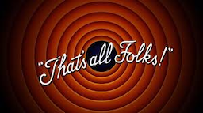

**Academic Methodologies**
  
Prof. Dr. Lena Gieseke \| l.gieseke@filmuniversitaet.de \| Film University Babelsberg KONRAD WOLF  


## Session 08


## Your Paper


### Task 08.01 - Feedback Version (Optional)


Put everything you have so far into the [paper template]() (<span style="color: red;">to be added on Friday</span>).

If you submit this work in progress version before July 27th, I will give you feedback before August 7th.

*Submission*: Your work in progress paper as pdf.


### Task 08.01 - The Final Paper


You find all information in [Chapter 01 - ACS FUB](../../02_scripts/am_01_conference_script.md).


## Wrapping Up

## Task 08.03 - Course Review

* How would you rate the difficulty of this lecture from 1 (far too easy) to 5 (far too difficult)?
* How would you rate the amount of work you had to put into this lecture so far from 1 (no work at all) to 5 (far too much work)?
* Which one was your favorite chapter, which one your least favorite?
* Do you feel well prepared to write your short paper? If not, what was missing?
* Please feel free to add any feedback you want to give!





  


  

---
  
Answer all questions directly in a copy of this file. Submit your copy as `am_XX_lastname.md` in your submissions folder (replace the XX with the number of the session). 
  

Please add the following header at the beginning of your Markdown file:

```md
---
layout: default
title: Homework
nav_exclude: true
---
```
  

---

**Happy Papering!**
