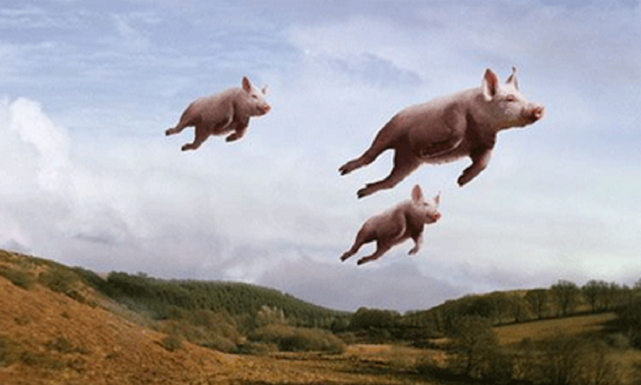
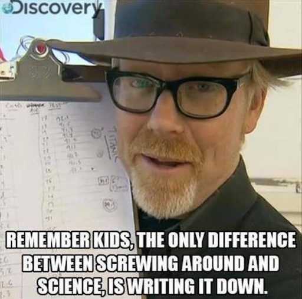
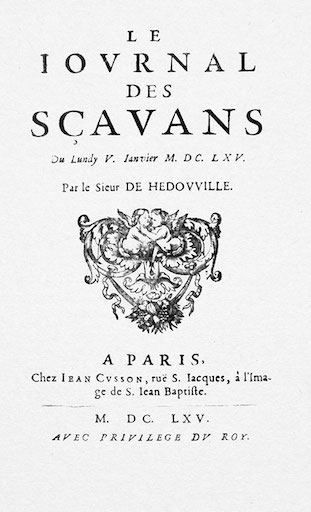
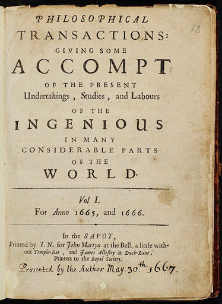

name: inverse
layout: true
class: center, middle, inverse
---

# Academic Methodologies

#### - Introduction -

  

### Prof. Dr. Lena Gieseke | l.gieseke@filmuniversitaet.de  

#### Film University Babelsberg KONRAD WOLF

---

# Master Thesis Preparation!

---
layout: false

.center[ .imgref[[[tes]](https://www.tes.com/lessons/t7r8HisPgaaW0A/flying-pigs)]]

---

.center[ .imgref[[[imgur]](https://imgur.com/gallery/ex4PAUZ)]]

???
  

* Adam Savage is an American special effects designer, actor, educator, and television personality. He is best known as the co-host of the popular television series "MythBusters," which aired on the Discovery Channel from 2003 to 2016. Alongside Jamie Hyneman, Savage tested the validity of various myths, urban legends, and popular misconceptions through scientific methods and experimentation.

---

.center[ .imgref[[[wikipedia]](https://en.wikipedia.org/wiki/Journal_des_s%C3%A7avans#/media/File:1665_journal_des_scavans_title.jpg)]  .imgref[[[wikipedia]](https://en.wikipedia.org/wiki/Philosophical_Transactions_of_the_Royal_Society#/media/File:Philosophical_Transactions_Volume_1_frontispiece.jpg)]]

---
## Topics

--
.left-even[
* Conference Simulation 
* Literature            
* Anatomy of a Paper      

]

---
## Topics

.left-even[
* Conference Simulation 
* Literature            
* Anatomy of a Paper      

Fokus: Your Paper!
]

--

.right-even[
* Research              
* Reasoning             
* HCI                   
* Experiments           
* Statistics            
* Qualitative Research  
* Artistic Research
* Academic Publishing   
* Academic Careers      

]

---
## Topics

The requirement for a Creative Technologies academic Master thesis:

> The ability to conceptualize and contextualize discourse, critical reflection and academic work.

???

> § 6 (3) Der wissenschaftliche Teil der Masterarbeit (16 LP) soll belegen, dass die/der Studierende die Fähigkeit zum **konzeptionellen und kontextualisierenden Diskurs, zur kritischen Reflexion und zur wissenschaftlichen Arbeit** besitzt. Der **Inhalt soll sich auf den praktischen Teil der Masterarbeit beziehen**.

---
## Today

--
* ACS FUB

--
* Course setup

--
* Anatomy of a Paper

---
template:inverse

### Academic Conference Simulation at the Film University Babelsberg KONRAD WOLF

# ACS FUB

???
  

* The overall goal of this lecture is to help you to conduct your own research projects. Please keep in mind that we will start small with your projects and papers. 

---
## ACS FUB 2026

--
* Practical exercise for academic writing (your master thesis)

--
* Replication of a typical process of submitting a research paper

--
* Application of the lecture topics

--

The simulation includes

--
* The submission of a (short-) paper

--
* Writing and receiving reviews

--
* The presentation of your work in front of your peers

--
* A best paper award

---
.header[ACS FUB 2026]

## The Paper

--
* Adhere to an academic format
    * E.g. introduction, contributions, related work, problem statement, solution, future work
--
* Tell an *academic story*

---
.header[ACS FUB 2026 | The Paper]

## Possible Topics

--
* Any topic of your choice within the field of Creative Technologies

--
* The research itself does not need to be new

--
* The paper can relate to your 1st term project, Bachelor thesis, or any other already existing project

???
  

* I highly recommend to try to come up with a topic in the context of your 1st term project as you have already put in a lot of thought and effort into it and it might have a greater chance of publication with an accompanying practical implementation. There are plenty of more practical and / or artistic oriented venues.

--
    * **The paper must include a substantial amount of original writing**
    * You can not re-use a short-paper
    * You can not re-use something that is already published

---
.header[ACS FUB 2026 | The Paper]

## AI Tools

--

* You are allowed to use any tool you want

--

* You must document your usage in the Acknowledgement Section of the paper 

???

You are allowed to use any tool you want but must document your usage (which tool, including its version was used for what?) in the Acknowledgement Section of the paper. 
  
However, reflect on when it makes sense to utilize a tool and when not. Within the class you should learn academic thinking and writing (and not "*how to use an AI tool*"). 

Also, in academic contexts, the use of AI Tools gets more more strictly regulated. For example, the [EuroVis conference](https://eurovis.org.uk/author-guidelines/) has the following rule for paper authors:

> **Generative AI tools may not be used to generate scientific content or text.** Limited use for grammar correction, language polishing, or rephrasing is permitted, but must be acknowledged in the Acknowledgement Section of the paper with a clear description of purpose and manner of use (e.g., “We used [tool name] solely for grammar correction and language polishing.”).

--

> What do you want to learn with this class? 
  

???
For this class, I personally recommend that you stay away from any AI help. This will be hard but a valuable and maybe even necessary learning experience. 

---
.header[ACS FUB 2026 | The Paper]

## Format

The paper must follow the format guidelines otherwise it is not accepted.

--
* 4-6 pages (without references)
* In English
* Abstract of <= 1000 characters
* Written with the given template

--

Submission

* As pdf
* Through the conference management system EasyChair

???
  

* https://easychair.org

---
.header[ACS FUB 2026]

## Reviews

--
* You will write and receive two reviews for your paper from your fellow students

--
* Reviews evaluate the content but also form and language of your paper

--
    * There will be a review template

--
* If there are revision requests, these must be worked in for the final version of the paper

---
.header[ACS FUB 2026]

## Reviews

* Overall strength and weaknesses
* Novelty and usefulness
* Presentation

???

Please give your overall review of the paper. In particular emphasize its strengths, weaknesses and novelties as well as its fit to Creative Technologies.

* Originality
* Clarity of presentation
* Technical and/or methodological soundness
* Importance, utility
* Completeness of references
* Best paper award

---
.header[ACS FUB 2026]

## Deadlines

--
All deadlines (all dates 20:00 GMT) are hard. Late submissions are not accepted.

--
* 01.07.26: Submission opens
* 25.09.26: Abstract Due
* 30.09.26: Paper Due
* 02.10.26: Review Start
* 16.10.26: Review Due
* tba: Author Notification
* tba: Conference

---
.header[ACS FUB 2026]

## Deadlines

Unfortunately deadline extensions due to illness will be difficult. If you get sick close to the deadline, please get in touch with me asap.

---
template: inverse

# Course Setup

???
  

* [Course Website](https://github.com/ctechfilmuniversity/lecture_ss26_academic_methodologies)

---
template:inverse

### The End

# 👋🏻
