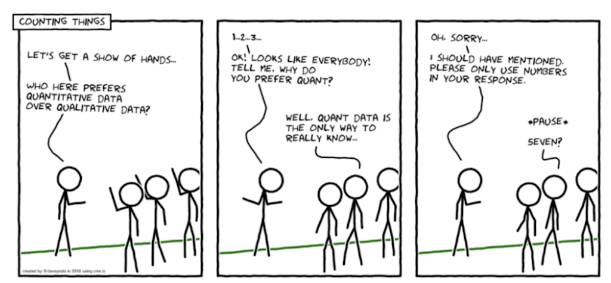
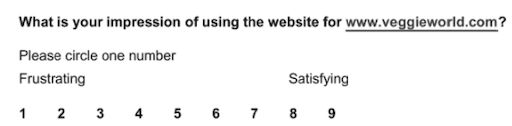
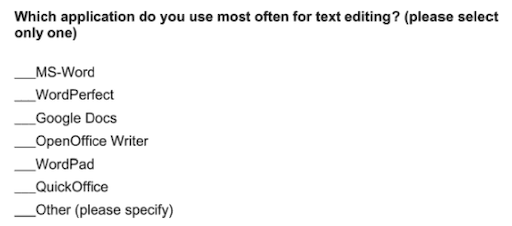
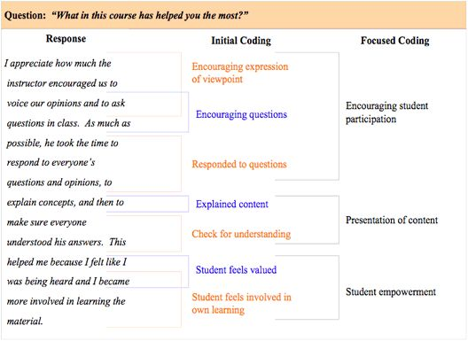
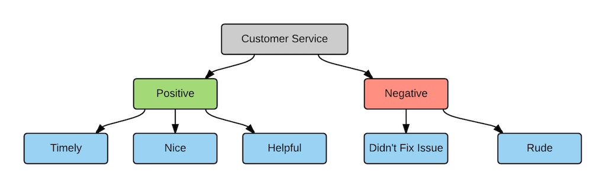
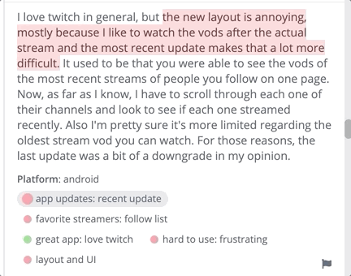

name: inverse
layout: true
class: center, middle, inverse
---

# Academic Methodologies

### Prof. Dr. Lena Gieseke | l.gieseke@filmuniversitaet.de  

#### Film University Babelsberg KONRAD WOLF

---
template:inverse

# Qualitative Research

---
layout: false

  
[[Dave Yeats]](https://medium.com/indeed-engineering/qualitative-before-quantitative-how-qualitative-methods-support-better-data-science-d2b01d0c4e64)

---

## Research Methods

Qualitative research methods are, for example:

--

* Case Studies
* Surveys
* Diaries
* Interviews
* Ethnographie
  
--
  
These methods are usually analyzed by *coding*.

---
## Research Methods

Qualitative research methods are, for example:
  
* **Case Studies**
* **Surveys**
* Diaries
* **Interviews**
* Ethnographie
  
  
These methods are usually analyzed by *coding*.

???
  

* A **diary** is a document created by an individual who maintains regular recordings about events in their life, at the time that those events occur.
    * These recordings can be anything from a simple record of activities (such as a schedule) to an explanation of those activities to personal reflections on the meaning of those activities. When you are asking people to record information that is fluid and changes over time, such as their mood, or about multiple events that occur within the day, diaries are generally more accurate than other research methods (Alaszewski, 2006).
    * Open in what is recorded, it can be anything from the participants activities, to mood, etc. 
        * For observations that can not easily be measured, such as happiness
    * Appropriate when there little knowledge about a scenario
    * Used to find patterns, motivations, behavior and habits
    * Example - Time Diaries to Study User Frustration
* **Ethnography** is the type of qualitative research that involves immersing yourself in a particular community or organization to observe their behavior and interactions up close. 
    * understanding the context of technology usage. By examining the human, social, and organizational contexts of technology, a deeper understanding of who these users are can be developed. In ethnographic traditions, a better understanding of a group of people and their traditions and processes is itself a noble and worthwhile goal. However, in the HCI community, ethnography is often used as a first step, to understand a group of users, their problems, challenges, norms, and processes, with the eventual goal of building some type of technology for them or with them.
    * The researcher becomes part of the study

---
template:inverse

## Case Studies

---
.header[Qualitative Research Methods]

## Case Studies

--

> A case study is an in-depth study of a specific instance or few instances, usually conducted within a specific real-life context.  

--

* Context-dependent
* Deep and narrow
* Small set of samples
* Does not necessarily aim for generalization

--

Traditionally, a qualitative method, in reality often a mixed method.

???
  

* They are deep and narrow, focusing on thorough exploration of a small set of samples. They do not aim for generalization.

* For experiments, surveys, etc. it is usually the more the merrier in regard to the number of samples. However, for certain research projects and for certain scenarios a large sample is extremely difficult if not impossible. Fortunately, this is not a cause for despair. Case studies, in which researchers study a small number of participants (possibly as few as one) in depth, can be useful tools for information gathering and evaluation.  

---
.header[Qualitative Research Methods]

## Case Studies

1. Feasibility study: *Is it possible?*
    * Proof by construction; one first case

.footnote[Serge Demeyer. *Research Methods in Computer Science*. University of Antwerp.]

---
.header[Qualitative Research Methods]

## Case Studies

1. Feasibility study: *Is it possible?*
2. Pilot Case / Demonstrator: *Is it appropriate?*
    * Demonstrated on a simple yet representative case

.footnote[Serge Demeyer. *Research Methods in Computer Science*. University of Antwerp.]

---
.header[Qualitative Research Methods]

## Case Studies

1. Feasibility study: *Is it possible?*
2. Pilot Case / Demonstrator: *Is it appropriate?*
3. Comparative Study: *Is it better?*
    * Score criteria check-list; often by applying on one or few cases

.footnote[Serge Demeyer. *Research Methods in Computer Science*. University of Antwerp.]

---
.header[Qualitative Research Methods]

## Case Studies

1. Feasibility study: *Is it possible?*
2. Pilot Case / Demonstrator: *Is it appropriate?*
3. Comparative Study: *Is it better?*
4. Observational Study: *What is it?*
    * Observing a series of cases

.footnote[Serge Demeyer. *Research Methods in Computer Science*. University of Antwerp.]

---
.header[Qualitative Research Methods]

## Case Studies

1. Feasibility study: *Is it possible?*
2. Pilot Case / Demonstrator: *Is it appropriate?*
3. Comparative Study: *Is it better?*
4. Observational Study: *What is it?*
5. Literature Survey: *What is known?*
    * Cases = selected papers

.footnote[Serge Demeyer. *Research Methods in Computer Science*. University of Antwerp.]

---
.header[Qualitative Research Methods]

## Case Studies

1. Feasibility study: *Is it possible?*
2. Pilot Case / Demonstrator: *Is it appropriate?*
3. Comparative Study: *Is it better?*
4. Observational Study: *What is it?*
5. Literature Survey: *What is known?*
6. Formal Model: *Underlying concepts?*
    * Often explained using one or few cases

.footnote[Serge Demeyer. *Research Methods in Computer Science*. University of Antwerp.]

---
.header[Qualitative Research Methods]

## Case Studies

1. Feasibility study: *Is it possible?*
2. Pilot Case / Demonstrator: *Is it appropriate?*
3. Comparative Study: *Is it better?*
4. Observational Study: *What is it?*
5. Literature Survey: *What is known?*
6. Formal Model: *Underlying concepts?*
7. Simulation: *What if?*
    * Test prognoses with real observations obtained via one or few cases

.footnote[Serge Demeyer. *Research Methods in Computer Science*. University of Antwerp.]

---
.header[Qualitative Research Methods]

## Case Studies

1. Feasibility study: *Is it possible?*
2. Pilot Case / Demonstrator: *Is it appropriate?*
3. Comparative Study: *Is it better?*
4. Observational Study: *What is it?*
5. Literature Survey: *What is known?*
6. Formal Model: *Underlying concepts?*
7. Simulation: *What if?*

.footnote[Serge Demeyer. *Research Methods in Computer Science*. University of Antwerp.]

???

1. Feasibility study: *Is it possible?*
    * Proof by construction; one first case
2. Pilot Case / Demonstrator: *Is it appropriate?*
    * Demonstrated on a simple yet representative case
3. Comparative Study: *Is it better?*
    * Score criteria check-list; often by applying on one or few cases
4. Observational Study: *What is it?*
    * Observing a series of cases
5. Literature Survey: *What is known?*
    * Cases = selected papers
6. Formal Model: *Underlying concepts?*
    * Often explained using a case
7. Simulation: *What if?*
    * Test prognoses with real observations obtained via one or few cases

---
.header[Qualitative Research Methods | Case Studies]

## Choosing Cases

A case can be pretty much anything:

* As representative as possible
* Multiple cases, similar scenarios
* Edgy cases, outlier
* Critical cases

???

There are really no rules on what a case can be. You can chose a case as representative as possible, multiple-cases, edgy cases, critical cases and so on.  

--

How you chose your case must be thoroughly described. You could also use a specific method, e.g. a *screening survey* to find your case. 

???
  

* A carefully constructed survey of potential participants can provide data that informs your selection process. Such surveys might assess both the fit between the participants and your criteria and the willingness of the participants to commit their time and energy to the success of the study.

---
.header[Qualitative Research Methods | Case Studies]

## Examples

* How do populist politicians use narratives about history to gain support? → Case studies of narratives used by Hungarian prime minister Viktor Orbán and US president Donald Trump.

--
* How can teachers implement active learning strategies in mixed-level classroom? → Case study of a local school that promotes active learning.

--
* What are the main advantages and disadvantages of wind farms for rural communities? → Case studies of three rural wind farm development projects in different parts of the country. 

---
.header[Qualitative Research Methods | Case Studies]

## Examples

* How are marketing strategies changing the relationship between companies and consumers? →  Case study of the iPhone X marketing campaign.

--
* How do experiences of work in the gig economy (temporary, flexible jobs) differ by gender, race and age? → Case studies of a number of Lieferando and Uber drivers in Berlin.

---
.header[Qualitative Research Methods | Case Studies]

## Example: Research Through Design

???
* What is the case?

--

The case is a design artifact 

--
vs. real-world phenomena, as with "traditional" case studies.

--

 
The design practice itself is used as a method of inquiry.  

> The design process is central to the research, not just the outcome.

--
  
* Focuses deeply on a specific context or artifact
* Situated, context-rich
* Generalizable through reflection on particular examples

???

Researchers generate knowledge by creating, reflecting on, and analyzing designed artifacts (such as prototypes, systems, or experiences).

Key points:
	•	The design process is central to the research, not just the outcome.
	•	It produces situated, practice-based knowledge.
	•	Reflection on the design process and decisions helps generate insights.
	•	Common in interaction design, artistic research, and creative technologies.

In short: RtD uses designing as a way to investigate and understand complex issues—not just to solve them.

---
template:inverse

## Surveys

---
.header[Qualitative Research Methods]

## Surveys

--

> A survey is a method of gathering information by asking questions to a subset of people, the results of which can be generalized to the wider target population. 

--

* Easy to setup, easy to mess up

???
  
* One of the most commonly used research methods, across all fields of research
* One of the reasons why surveys may be maligned is that they are often used not because they are the most appropriate method but because they are the easiest method. There are a lot of bad research projects, in which professors or students quickly write a survey, do not do sufficient pilot testing of the survey questions, distribute it to first-year students, and then claim that the survey results can generalize to other populations. Unless the actual focus of the research is university students, then this common research scenario is misguided.

---
.header[Qualitative Research Methods]

## Surveys

Survey research may be the most appropriate methodology for measuring parameters such as

--

* *Attitudes*, *Intent*, *Awareness*, etc.
* *User experiences*
* *Characteristics of users*
* *Over-time comparisons*

--

Surveys work with a large sample size. The gathered data usually aims to generalize.

---
.header[Qualitative Research Methods]

## Surveys
  
--
Can be set up as qualitative as well as quantitative, depending on the questions.

--

 

**Surveys are less appropriate for precise measurements.**

---
.header[Qualitative Research Methods]

## Surveys

Surveys usually rely on users to complete the survey on their own. Hence the survey must be carefully designed.

--
* Target users and inclusion and/or exclusion criteria
* Enough background information
* Self-explanatory, explicit and non-biased questions
* A balance between length and data collection

--

A common value for a response rate is 20% (only!).

???
  

A survey has two structures

* the *overall structure* of a survey, 
* and the *structure of a single question*.

  
The main challenge is to develop precise but easy to understand and non-biased questions. 

Think of the overall structure as the *storyline* of the survey.

* Instructions
* Motivation
* Flow of topics
* Grouping of questions
* Demographic questions

You also should think about the visual layout.

Single questions can be categorized in three types: as 

* open-ended questions, 
* closed-ended questions with ordered response categories, or 
* closed-ended questions with unordered response categories 
 

* The questions do not exist in a vacuum, rather, they are part of an overall survey structure. Try to create a story-line for the survey so that respondents get a sense of order. Usually a survey, in any format, must begin with instructions. These instructions must make clear how the respondent is to interact with the survey (Babbie, 1990, as cited in [1]). It also helps if you can motivate people to the survey and complete it. Generally, it is a good idea to leave demographic questions until the end of the survey, as these are the least interesting (Babbie, 1990, as cited in [1]). Questions relating to a similar topic or idea should be grouped together (Dillman, 2000, as cited in [1]). You should use sections and a well-balanced layout. This tends to lower the cognitive load on respondents and allows them to think more deeply about the topic, rather than switching gear after every question.

---
.header[Qualitative Research Methods | Surveys]

## Open-Ended Questions

???
  

* Give respondents complete flexibility in their answers
* Complex data analysis
* Must be carefully worded for respondents to stay on topic

--

* *Why did you stop using software X?*

???
  

* This open-ended question provides no information about the possible causes; instead it requires the respondent to think deeply about what the causes might be (Dillman, 2000, as cited in [1]). The respondent may be too busy to come up with a complete response or may simply say something like "I didn't like the software". It is a very broad question. More specific questions might be:  

--
* *What barriers did you face in attempting to use software X to complete your tasks?*

???
  

* In that revision, the respondents could simply say, “none” but the question also invites the respondents to think carefully about the problems that they might have faced.

--
* *How did you feel about artwork X?* 

???
  

* These questions address more specific topics: ease of use and task completion. The respondents cannot simply answer "I didn't like it,” although they could just answer “yes” or “no” to the second question. Perhaps another way to reword that second question might be as:  

---
.header[Qualitative Research Methods | Surveys]

## Closed-Ended Questions

???
  

A number of choices is given.

--

* E.g. [Likert scale questions](https://en.wikipedia.org/wiki/Likert_scale)

.center[]

???
  
, which often take the form of a scale of 1 to 5, 7, or 9, ask users to note where they fall on a scale of, for example, *strongly agree* to *strongly disagree*.
* [[quis]](http://www.lap.umd.edu/quis/) *A closed-ended question with an ordered response.*

--

* Choices that do not have a logical order.

.center[]

???
  

* For instance, asking about types of software applications, hardware items, user tasks, or even simple demographic information such as gender. Closed-ended questions can allow for a single or multiple selections.
* [[1]]() *A closed-ended question with an unordered response.*

---
.header[Qualitative Research Methods | Surveys]

## Questions - Common Problems

--
* Missing precision leads to confusion and random answers 

???
  

* (e.g., "Which meaning has astronomy in your life?")

--
* A *double-barreled question* asks two separate, and possibly related questions 

???
  
* (e.g., “How long have you used the Word processing software and which advanced features have you used?”). These questions need to be separated.

--
* Complex phrasings, e.g., with negations, cause confusion

???
  

* (e.g., “Do you agree that the e-mail software is not easy to use?”) can cause confusion for the respondents.

--
* Biased wordings 

???
  

* in questions (such as starting a sentence with “Don't you agree that…”) can lead to biased responses. If a question begins by identifying the position of a well-respected person or organization (e.g., “Angela Merkel [or Rezo] takes the view that…”), this may also lead to a biased response.

--
* *Hot-button words* leading to biases

???
  
such as “left-winged,” “conservative,” “terrorism,” etc. can lead to biased responses.
* Researchers should carefully examine their questions to determine if any of these problems are present in their survey questions (Babbie, 1990):

---
.header[Qualitative Research Methods | Surveys]

## Existing Surveys

There are many existing surveys

* Validated in the [research literature](https://garyperlman.com/quest/) in HCI
* In a commercial context ([Survey Monkey](https://www.surveymonkey.com/mp/survey-templates/), [Qualtrics](https://www.qualtrics.com/marketplace/survey-template/), etc.)

???
  

*  For most research purposes, there will be a need to create a new survey. However, for tasks such as usability testing and evaluation, there are already a number of existing survey tools. Usually, these surveys can be modified in minimal ways.

---
.header[Qualitative Research Methods | Surveys]

## Pilot Testing

* Crucially important
* Often neglected

???
  

After a survey tool is developed, it is very important to do a pilot study to help ensure that the questions are clear and unambiguous.  

A pilot study should focus on

* the questions, and
* interface of the survey.

---
template:inverse

## Interviews & Focus Groups

---
.header[Qualitative Research Methods]

## Interviews & Focus Groups

--

> Interviews are targeted discussions with carefully selected respondents.
  
  
???
  
* What are the ecological effects of wolf reintroduction? → Case study of wolf reintroduction in Yellowstone National Park.
* Potential users, domain experts and stakeholders as respondents for example can help human-computer interaction researchers understand needs, challenges, reactions to new tools, and uses of tools in practice. Conducting effective interviews requires careful consideration of *who* to involve as participants and *how* the sessions might be structured, with possibilities ranging from completely structured interviews to semi-structured and unstructured interviews.  

  
> Focus groups are the interview of multiple participants at once, in a group.

* The choice of one-to-one interviews or focus groups involves trade-offs in time, expediency, depth, and difficulty. Focus groups let you hear from many people at once but with less depth from any given individual. You should consider the trade-off between this loss of depth and the potentially fuller understanding that may arise from a conversation between participants having multiple perspectives. Unfortunately, there are no guarantees: this intriguing dynamic conversation might not materialize. As the moderator of a focus group, you have a very important role to play: this is where the difficulty comes in. Skillful moderation can keep conversation focused and inclusive, increasing your chances of getting good data.

--

* Useful for understanding individual perspectives
* Crucial: *who* to involve and *how* to structure the sessions
* Structured, semi-structured and unstructured

---
template: inverse

# Analyzing Qualitative Data

---
.header[Qualitative Research Methods]

## Analysis

Qualitative methods do not aim to eliminate *subjectivity*. They accept that subjectivity is inherent to process of interpreting certain data.   

--

 

Also, analysis is often meant to be *explorative* without a pre-existing hypothesis or such.

--
  

> We strive to show that interpretations are developed methodically, consistent with, and representative for the available data.

???
  

In terms of qualitative research, 

* *validity* means that we use well-established and well-documented procedures to increase the accuracy of findings. 
    * More strictly speaking, validity examines the degree to which an instrument measures what it is intended to measure (Wrench et al., 2013, as cited in [1])
* *reliability* refers to the consistency of results. 
    * If different researchers working on a common data set come to similar conclusions, those conclusions are said to be reliable.If different researchers working on a common data set come to similar conclusions, those conclusions are said to be reliable.

---
.header[Qualitative Research Methods | Analysis]

## Coding

--

The goal is to give the unstructured data, e.g. found in texts, a structure.  

--
  
> Coding is the process of labeling and organizing your qualitative data to identify different themes and the relationships between them.  

???
  

* A *reliable* and *valid* method is *coding*, which assigns labels to observations.

* Imagine, you collected feedback about a developed website with open-ended, free-text questions (from reviews, surveys, complaints, chat messages, interviews, case notes, social media posts, etc.) and you end up with hundreds of free-text responses. How can you turn all of that text into applicable information to improve your system? By coding qualitative data.
* When coding e.g. open-ended text answers, you assign labels to words or phrases that represent important (and recurring) themes in each response. 

--

Once you have established such a coding, you can analyze your data. This can also be understood as a *thematic analysis*.

???
  

   Thematic analysis extracts themes from text by analyzing the word and sentence structure.

.center[[[pinimg]](https://i.pinimg.com/564x/4a/dc/45/4adc4569928cdb623f4ba21f788b7102.jpg)]

---
.header[Qualitative Research Methods | Analysis | Coding]

## Codes

> A code is a label.

--

Labels are ideally words or phrases.  

???
  

* .todo[TODO:] https://web.atlasti.com

--
* Deductive coding: predefined set of codes

???
  

* **Deductive** coding means you start with a *predefined set of codes*, then assign those codes to the new qualitative data.  

These codes might come from previous research, or you might already know what themes you’re interested in analyzing.  

Deductive coding is also called concept-driven coding.  

* For example, let’s say you’re conducting a survey on user experience with a web-store. You want to understand the problems that arise from long processing wait times, so you choose to make “processing wait time” one of your codes before you start looking at the data.  

The deductive approach can save time and help guarantee that your areas of interest are coded. But you also need to be careful of bias; when you start with predefined codes, you have a bias as to what the answers will be. Make sure you don’t miss other important themes by focusing too hard on proving your own hypothesis.  

--
* Inductive coding: create codes based on the data 

???
  

**Inductive** coding, also called *open coding*, creates codes based on the qualitative data itself.  
  

* You don’t have a set codebook; all codes arise directly from the survey responses.

* Here’s how inductive coding works:

1. Break your qualitative dataset into smaller samples.
2. Read a sample of the data.
3. Create codes that will cover the sample.
4. Reread the sample and apply the codes.
5. Read a new sample of data, applying the codes you created for the first sample.
6. Note where codes don’t match or where you need additional codes.
7. Create new codes based on the second sample.
8. Go back and recode all responses again.
9. Repeat from step 5 until you’ve coded all of your data.

If you add a new code, split an existing code into two, or change the description of a code, make sure to review how this change will affect the coding of all responses. Otherwise, the same responses at different points in the survey could end up with different codes.

Sounds like a lot of work, right?

Inductive coding is an iterative process, which means it takes longer and is more thorough than deductive coding. But it also gives you a more complete, unbiased look at the themes throughout your data.  

## Coding Frames

When you create your codes, you need to put them into a *coding frame*. 

> A coding frame represents the organizational structure of the themes in your research. 

There are two types of coding frames: flat and hierarchical.

* A flat coding frame assigns the same level of specificity and importance to each code. While this might feel like an easier and faster method for manual coding, it can be difficult to organize and navigate the themes and concepts as you create more and more codes. It also makes it hard to figure out which themes are most important, which can slow down decision making. 
* Hierarchical frames help you organize codes based on how they relate to one another. For example, you can organize the codes based on your customers’ feelings on a certain topic:

### Hierarchical Coding Frame

.center[[[thematic]](https://getthematic.com/insights/coding-qualitative-data/)]

Hierarchical framing supports a larger code frame and lets you organize codes based on an organizational structure. It also allows for different levels of granularity in your coding.  

In this example:

1. The top-level code describes the topic (customer service).
2. The mid-level code specifies whether the sentiment is positive or negative.
3. The third level details the attribute or specific theme associated with the topic.

* Whether your code frames are hierarchical or flat, your code frames should be flexible. Manually analyzing survey data takes a lot of time and effort; make sure you can use your results in different contexts.

For example, if your survey asks customers about customer service, you might only use codes that capture answers about customer service. Then you realize that the same survey responses have a lot of comments about your company’s products. To learn more about what people say about your products, you may have to code all of the responses from scratch! A flexible coding frame covers different topics and insights, which lets you reuse the results later on.  

## Manual Coding

Different researchers have different processes, but manual coding usually looks something like this:

1. Choose whether you’ll use *deductive* or *inductive* coding.
2. Read through your data to get a sense of what it looks like. Assign your first set of *codes*.
3. Go through your data line-by-line to code as much as possible. Your codes should become more detailed at this step. 
4. Categorize your codes and figure out how they fit into your *coding frame*.
5. Identify which themes come up the most — and start your interpretation of them.

???
  

* https://web.atlasti.com

## Automatic Coding

Automating the analysis is slowly becoming a valuable option due to advances in natural language processing and machine learning.

  
[[thematic]](https://getthematic.com/insights/coding-qualitative-data/) 

*  Unlike manual analysis, which is prone to bias and doesn’t scale to the amount of qualitative data that is generated today, automating analysis is not only more consistent and therefore can be more accurate, but can also save a ton of time.
*The software Thematic categorizes qualitative data into themes.*

--

Manual human coding is still considered to be more accurate that automatic coding - but potentially more biased.

---
.header[Qualitative Research Methods | Analysis]

## Coding

> In summary, coding is the process of labeling and organizing your qualitative data to identify themes.

--

After you code your qualitative data, you can analyze it just like numerical data.

???
  

   Inductive coding (without a predefined code frame) is more difficult, but less prone to bias, than deductive coding. Code frames can be flat (easier and faster to use) or hierarchical (more powerful and organized). Your code frames need to be flexible enough that you can make the most of your results and use them in different contexts. When creating codes, make sure they cover several responses, contrast one another, and strike a balance between too much and too little information.  

--

 

Proper coding is necessary for a valid and reliable qualitative analysis! 

???
  

* Establish coding procedures and guidelines and keep an eye out for definitional drift in your qualitative data analysis.  
* Come up with a qualitative study design from the field of Creative Technologies.  

---
template:inverse

### The End

# 👋🏻
