name: inverse
layout: true
class: center, middle, inverse
---

# Academic Methodologies

#### - Statistics in a Nutshell -

  

### Prof. Dr. Lena Gieseke | l.gieseke@filmuniversitaet.de  

#### Film University Babelsberg KONRAD WOLF

---
layout:false

## Statistics?

???
  

* Is what?

--

> The practice or science of collecting and analyzing numerical data in large quantities, especially for the purpose of **inferring proportions in a whole from those in a representative sample**.  
  
\- Apple Dictionary

???
  
We are currently living in the best and worst of times regarding data and its evaluation. 

* The importance of statistics and an awareness about potential problems when using statistics to make general statements is not new. Let's hear what some smart people said about this.

???
  

* Both the power and corruption of statistics are daily on display.
* Machine Learning is a statistical model

---
## Statistics

> The numbers have no way of speaking for themselves. We speak for them. We imbue them with meaning. 

\- [Nate Silver](https://en.wikipedia.org/wiki/Nate_Silver)
  
---
## Statistics

> Like dreams, statistics are a form of wish fulfillment.  
  
\- [Jean Baudrillard](https://en.wikipedia.org/wiki/Jean_Baudrillard)

---
## Statistics
> Figures don't lie, but liars figure.  
  
\- [Samuel Clemens](https://en.wikipedia.org/wiki/Mark_Twain) (alias Mark Twain, 1835 – 1910)

???
  

> If your experiment needs statistics, you ought to have done a better experiment.  
  
  
\- [Ernest Rutherford](https://de.wikipedia.org/wiki/Ernest_Rutherford) (1871 – 1937)

* In this lecture, however, we aim for an accurate display of information, not to obscure it. 
* Let's have a look first on what kind of data we might be working with.
* The process of transforming collected information or observations to a set of meaningful, cohesive categories.
* In the above example, the information on age is numerical and does not need to be coded. The information on gender, highest degree earned, and previous software experience needs to be coded so that statistical software can interpret the input.
* Coding can lead to a deeper understanding and the emergence of relationships, patterns, etc. When coding your data, the most important thing to remember is to ensure the coding is consistent.

---
## Statistics

.center[  .imgref[[[solutions.ait.ac.th]](http://solutions.ait.ac.th/garbage-in-garbage-out/)]]

---
## Statistics

???

* What is the difference between descriptive and inferential statistics?

--

Descriptive statistics 

* Summarizes data 
* Information is presented in a manageable form  

???
  
* Helps to describe and to organize data
* Descriptive statistics *summarizes* data and helps to describe and to organize data. Information is presented in a manageable form.  
* An example for descriptive statistics?

--

 

Inferential statistics 

* Anlayses data
* Draws conclusions about a population based on samples
    * Based on rigid requirements on the data and maths

???
  
* Generalizes and makes judgments
* Inferential statistics *draws conclusions* about a population based on samples and helps to analyze data. Inferential statistics is used to generalize and make judgments. For that there are rigid requirements on the data for the maths to work and to allow for such generalizations.

.center[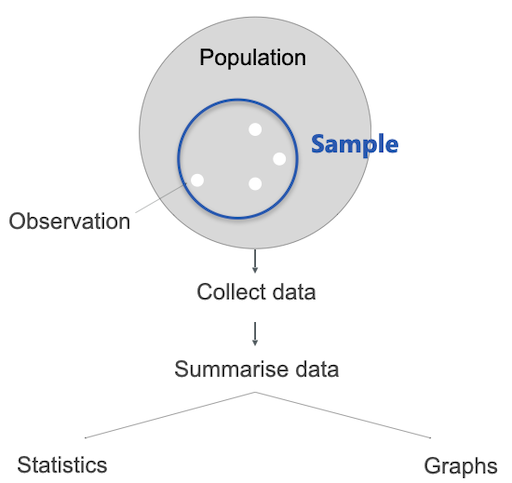]

---
template:inverse

# Descriptive Statistics 

---
.header[Descriptive Statistics]

## Graphs

.center[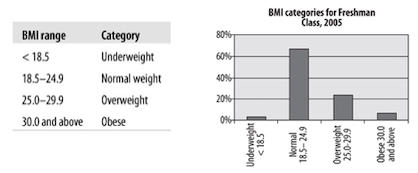].imgref[[[oreilly]](https://www.oreilly.com/library/view/statistics-in-a/9781449361129/ch04.html)]

---
.header[Descriptive Statistics]

## Graphs

.center[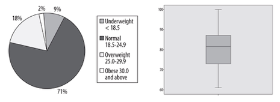].imgref[[[oreilly]](https://www.oreilly.com/library/view/statistics-in-a/9781449361129/ch04.html)]

---
.header[Descriptive Statistics]

## Graphs

.center[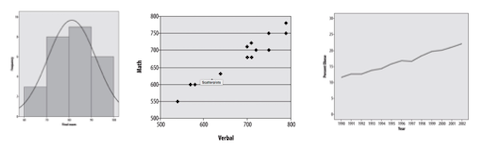].imgref[[[oreilly]](https://www.oreilly.com/library/view/statistics-in-a/9781449361129/ch04.html)]

---
.header[Descriptive Statistics]

## Graphs

.center[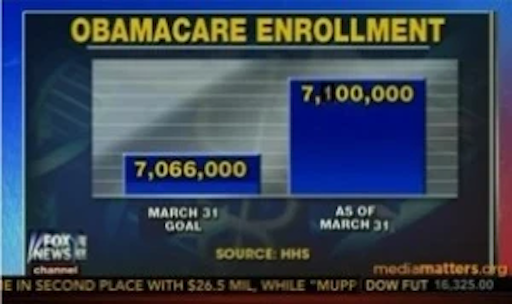].imgref[[[cellfish]](http://blog.cellfish.se/2014/08/lying-with-statistics.html)]

???
  

* *What might be the problem with the following bar charts?*
* Yes, exactly. One of the most common tricks used is to show small changes as huge by not using zero as the base in a diagram. 
* Looking at the Fox News graph it looks like as if there was a huge increase in the enrollment in Obamacare.  But the difference between the two numbers is only 33,000, which is in regard to the start value of 7,066,000 not that much. But as the graphic cuts off the bottom part of the graphs the increase is greatly exaggerated. Don't ask me what the intentions were, I always thought that Fox News was against Obamacare...

---
.header[Descriptive Statistics]

## Graphs

.center[].imgref[[[spiegel]](https://www.spiegel.de/politik/deutschland/rezo-video-die-youtube-angriffe-auf-die-cdu-im-spiegel-faktencheck-a-1268973.html) *Figure by Rezo*]

???
  

* In regard to the question of *wealth through inheritance*, Rezo showed the following figure:

---
.header[Descriptive Statistics]

## Graphs

.center[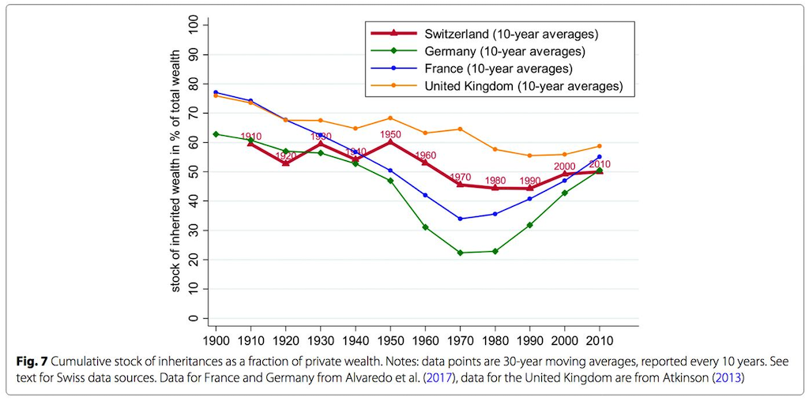].imgref[[[spiegel]](https://www.spiegel.de/politik/deutschland/rezo-video-die-youtube-angriffe-auf-die-cdu-im-spiegel-faktencheck-a-1268973.html) *Original by Alvaredo et al./ Atkinson/ CC BY 4.0*]

???
  

* Not only did Rezo remove the graphs of the other countries in comparison, he also cut the timeline - the oldest and most evil move in regard to graph manipulations! In this case the manipulated figure implies that the historically exceptionally values between the 1960-90 (as it becomes clear from the original figure) were a normal phase. Spiegel calls this in its article about the fact-checking of Rezo's video *ein absolutes No-Go*. This is especially disappointing, as the Spiegel points out, as there is enough valid data to underline the point Rezo was overall trying to make.

---
.header[Graphs]

.center[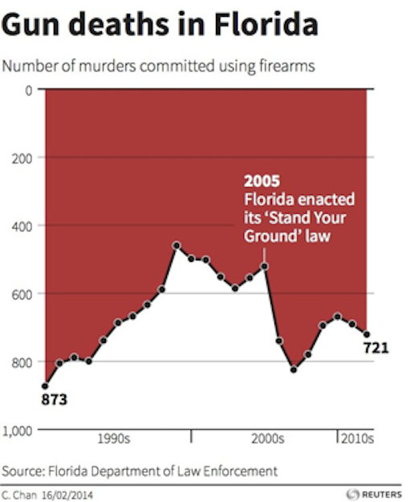].imgref[[[gregstevens]](http://gregstevens.com/2011/02/21/lying-with-statistics-101/)]

???
  

* Most people see in the graphic above a huge fall-off in the number of gun deaths after Stand Your Ground was passed. That is what the law was aiming for but that’s not what the graph shows. A quick look at the vertical axis reveals that the gun deaths are counted from top (0) to bottom (800). The highest peaks are the fewest gun deaths and the lowest ones are the most. A rise in the line, in other words, reveals a reduction in gun deaths. The graph below — flipped both horizontally and vertically — is more intuitive to most: a rising line reflects a rise in the number of gun deaths and a dropping a drop.

---
.header[Graphs]

.center[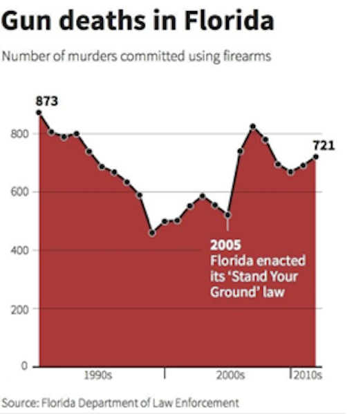].imgref[[[gregstevens]](http://gregstevens.com/2011/02/21/lying-with-statistics-101/)]

---
.header[Descriptive Statistics]

## Frequency Distributions

Counts the number of times each score occurs.

.center[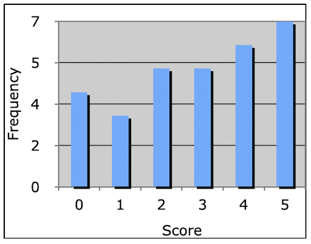]

--

 

*How can the data be summed up and described with a single value?*  

---
.header[Descriptive Statistics | Frequency Distributions]

## Measures of Central Tendency

Calculate a *central tendency* and the *centric point* of a distribution. 

???
  

* Any examples?

---
.header[Descriptive Statistics | Frequency Distributions]

## Measures of Central Tendency

Calculate a *central tendency* and the *centric point* of a distribution. 
 

.center[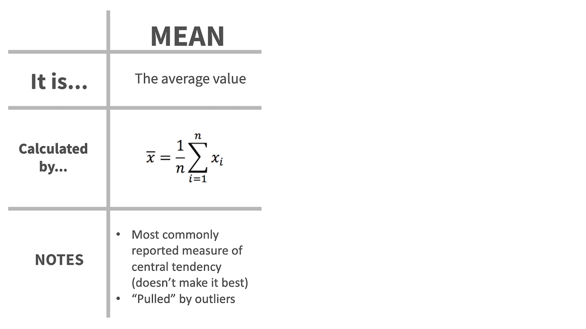]  
[[4]](https://docs.google.com/presentation/d/1cPWa6NqbEot8dBjVC7UKPjF72Q7myYjHqyBYS9HO_qg/edit#slide=id.g5137fefd78_1_189)

---
.header[Descriptive Statistics | Frequency Distributions]

## Measures of Central Tendency

Calculate a *central tendency* and the *centric point* of a distribution. 
 

.center[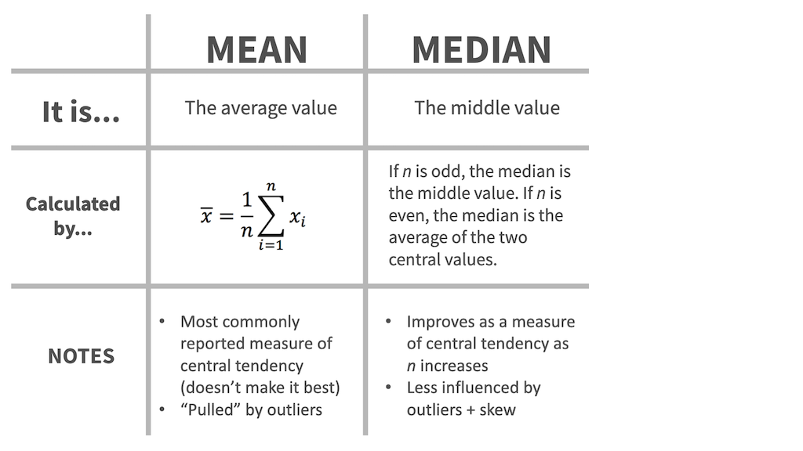]  
[[4]](https://docs.google.com/presentation/d/1cPWa6NqbEot8dBjVC7UKPjF72Q7myYjHqyBYS9HO_qg/edit#slide=id.g5137fefd78_1_189)

---
.header[Descriptive Statistics | Frequency Distributions]

## Measures of Central Tendency

Calculate a *central tendency* and the *centric point* of a distribution. 
 

.center[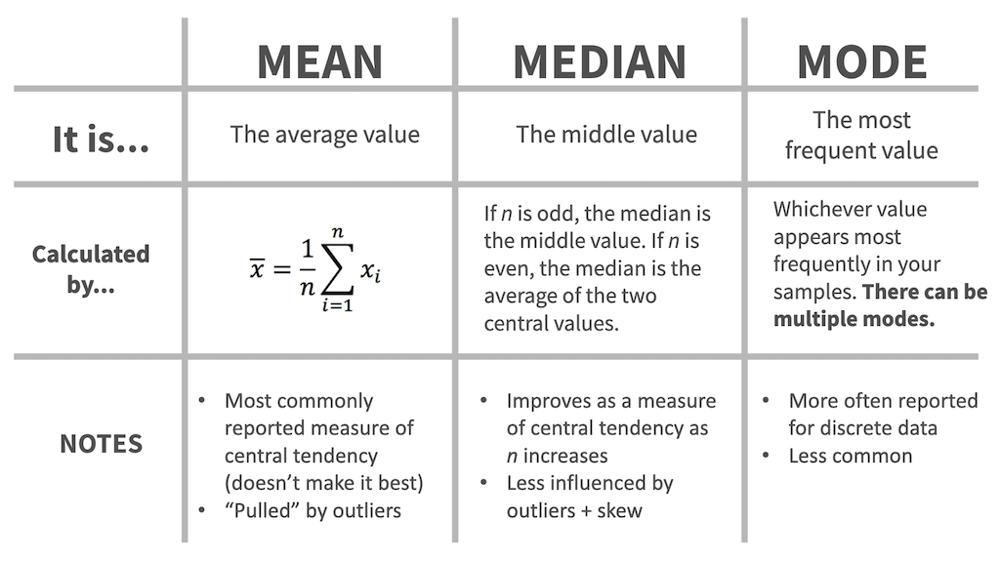]  
[[4]](https://docs.google.com/presentation/d/1cPWa6NqbEot8dBjVC7UKPjF72Q7myYjHqyBYS9HO_qg/edit#slide=id.g5137fefd78_1_189)

---
.header[Descriptive Statistics | Frequency Distributions]

## Measures of Central Tendency

.center[]  .imgref[[[taniapouli]](http://taniapouli.me/wp-content/uploads/2016/08/s2010_course.pdf)]

???
  

* What makes the two images different?

---
.header[Descriptive Statistics | Frequency Distributions]

## Measures of Central Tendency

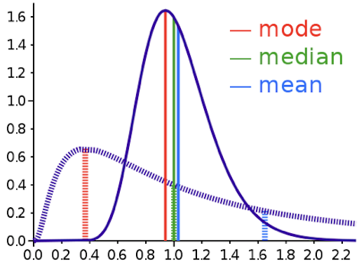  
.imgref[[[wiki]](https://en.wikipedia.org/wiki/Mean#/media/File:Comparison_mean_median_mode.svg)]

???
  

* If data is symmetrically distributed, the mean and median will be close, especially as n increases. If the data is skewed, mean, median and mode can differ greatly. Depending on our question, that might really matter... we will come back to this.

---
.header[Descriptive Statistics | Frequency Distributions]

## Measures of Central Tendency

> When is the mean not representative for a data set and why?

???
  

* For the data set of 5 5 5 5 5, the mean of 5 directly represents the actual values and is therefore a good measurement. However the single values of 6 8 4 1 6 differ quite strongly from the mean of 5, which therefore is not the best representation. This characteristic of how much the single values differ to the mean is reflected by the *variance* of a data set.

---
.header[Descriptive Statistics | Frequency Distributions]

## Measures of Spread

.center[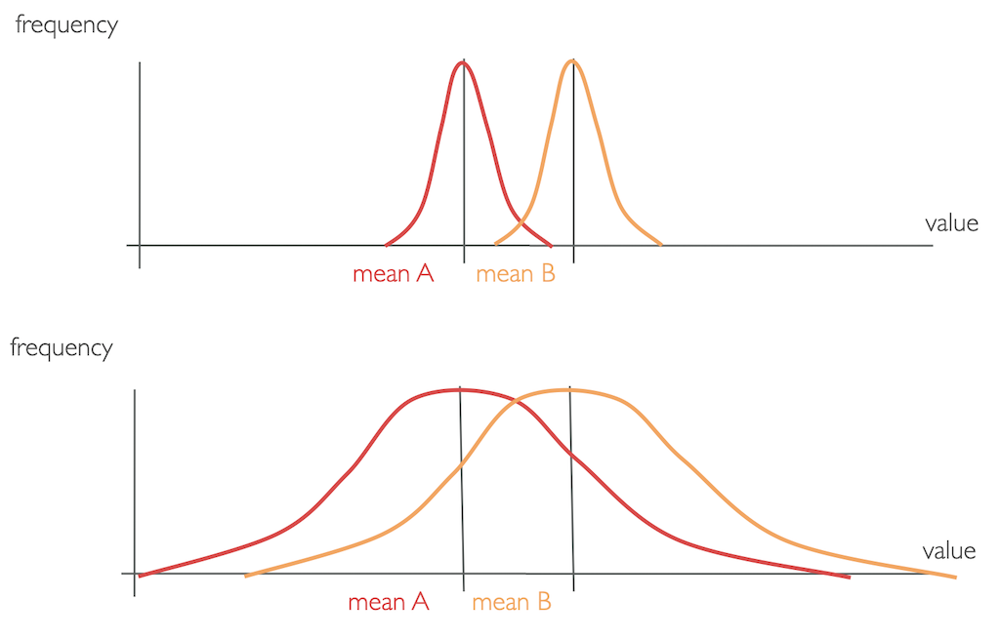]

???
  
To describe how data are situated around the central tendency, we use measures of data spread. 

* What makes them different, once again, is the *distribution* of values.

---
.header[Descriptive Statistics | Frequency Distributions]

## Measures of Spread

???
  

* Do you know one?

--

Mathematically, the variance is exactly the mean squared distance that values have to the mean. 

--

.left-even[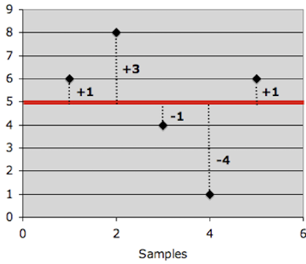]

--

.right-even[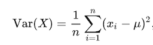]

???
  

* What is the standard variation?
* As the formula for variance shows, the units of variance are the units of the observation *squared*, *xi2* and in a variance's value can not be directly compared to the value range of the collected data. Hence, to get the metric back into units of the variable, we take the square root of the variance, which is called the *standard deviation σ*.
* A large value means that values are quite different from each other and that the data varies a lot. Hence, the mean is not representative for the data set. A small value means all data points are close to the mean with little variation. Hence, the mean is a valid representation of the data.
* Both *variance* and *standard deviation* measure the accuracy of the mean of data set and the variability of the data. Variance and standard deviation only differ in a scaling factor.

---
.header[Descriptive Statistics]

## Box and Whisker Plots

.center[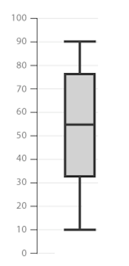]

???
  

* For an overview of the most important values, the core of a box and whisker plot, in short *boxplot*, looks as follows:
    * The box is bounded by the two inner quartiles of the data. This is called the *interquartile range* (IQR). Its middle line shows the median and the whiskers extend to the last observation within 1 step (usually 1.5 * IQR) from the end of the box.
* Quantiles are cut points that divide a sample of data into groups containing (as far as possible) equal numbers of observations. 

---
.header[Descriptive Statistics]

## Box and Whisker Plots

.center[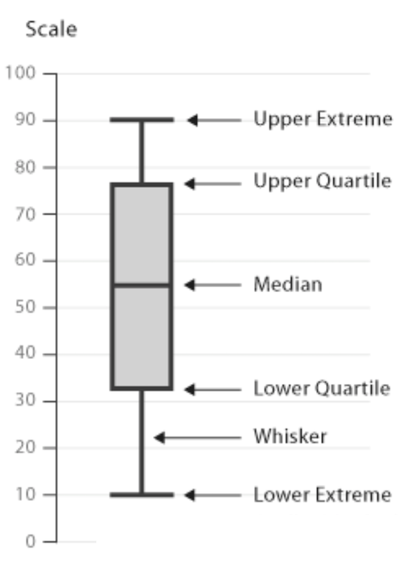]

???
  

.center[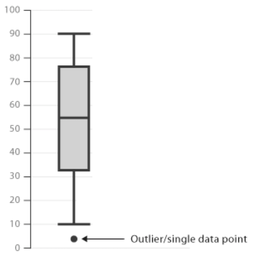]

* Any observations beyond the whiskers are plotted as individual points.

---
.header[Descriptive Statistics |  Box and Whisker Plots]

.center[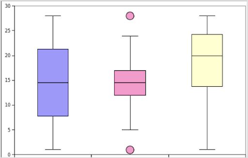]

???
  

* What do the histogram plots, meaning the frequency distributions, of the following box and whisker plots look like?

---
.header[Descriptive Statistics |  Box and Whisker Plots]

.center[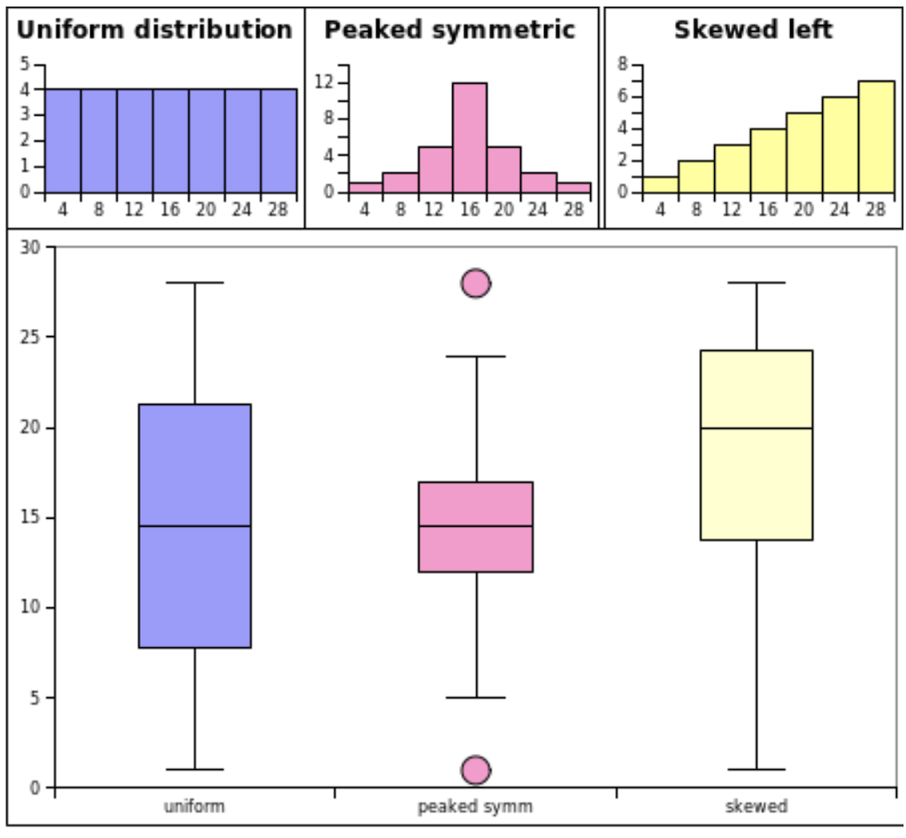]

---
## Descriptive Statistics

--

In descriptive statistics we use

* measures of central tendency (mode, median, mean), and
* measures of spread (variance, standard deviation)

to describe and summarize data.

--

 

We usually report

* mean and standard deviation values in the accompanying text, and
* a summary of the data as box plots graphically.

???

Hence, we can summarize a sample (meaning a set of data) using its mean and we can access the accuracy of that mean using the standard deviation.

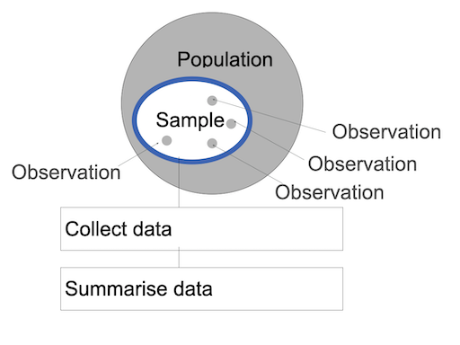  

But how well does one sample represent the population?

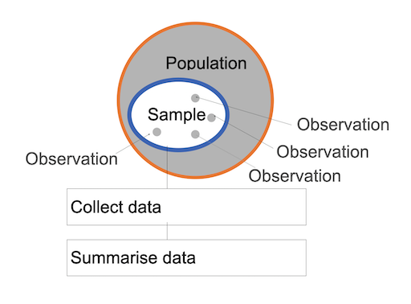  

Probably not too well…  

We could take several samples from the same population, each with its own mean.

.center[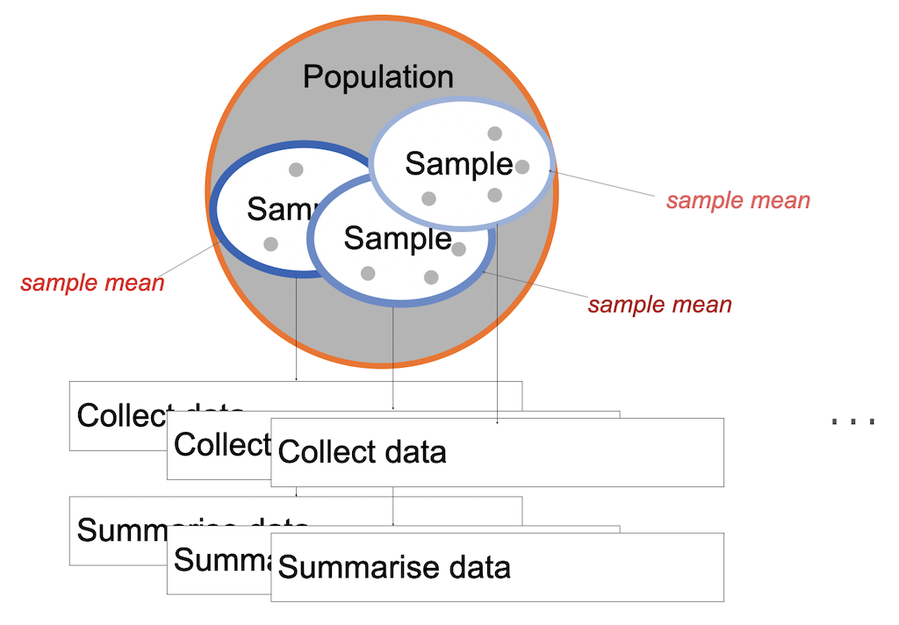]

We could take several samples from the same population, each with its own mean.

.center[]

Then, the question becomes whether the sample distribution is representative for the population?

???
  

* This question is answered with *inferential* statistics.

---
template:inverse

# Inferential Statistics

---
## Inferential Statistics

With inferential statistics you can reach to conclusions that extend beyond the immediate data alone but describe a population overall.

---
.header[Inferential Statistics]

## Hypothesis Testing

Determine the likelihood of a hypothesis about some parameter value to be true. 

???
  

* What is the approach here, key word: null hypothesis

--

* Null hypothesis H0: Assumes that there is no difference between two conditions
* Alternative hypothesis HA: Assumes significant differences between the two conditions

???
  

* Mü

--

We assume the null hypothesis to be true until proven otherwise.  

--

* Reject the null hypothesis (proven by the data)
* Fail to reject the null hypothesis

???
  

* The data is the evidence and we can make one of two decisions:

---
.header[Inferential Statistics]

## Hypothesis Testing

There are a variety of test available, each potentially including several steps.

???
  

* The first test, we need to have a look into is a test that uses a calculated probability to determine whether there is evidence to reject the null hypothesis, hence ideally showing that we have indeed observed an effect.
* There are two common tests for that, the [Critical Value approach](https://online.stat.psu.edu/statprogram/reviews/statistical-concepts/hypothesis-testing/critical-value-approach) and the [p-value approach](https://online.stat.psu.edu/statprogram/reviews/statistical-concepts/hypothesis-testing/p-value-approach). The p-value approach requires only one computation and most statistical software uses it. So let's have a look into that, starting with an example.

--
 

Common steps are:

--
* Test if there is an effect in comparison to random results

--
* Test how the data is distributed

--
* Test to quantify the effect

---
template:inverse

## Observed Effect or Random Results?

---
.header[Inferential Statistics]

## P-Value

--

> The probability of obtaining the results by chance.
  
--

It aims to prove statistical significance for a cause and effect!

???

* A small p-value means that the null hypothesis is very unlikely.
* A large p-value means that the  null hypothesis is very likely.

---
.header[Inferential Statistics | P-Value]

## Lady Tasting Tea

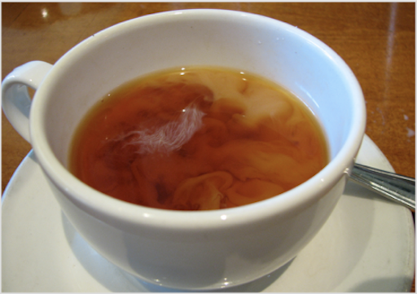  
.imgref[[[wiki]](http://en.wikipedia.org/wiki/File:Milk_clouds_in_tea.jpeg)]

???
  

* [Dr. Muriel Bristol](https://en.wikipedia.org/wiki/Muriel_Bristol), a female colleague of mathematician [Sir Ronald Fisher](https://en.wikipedia.org/wiki/Ronald_Fisher) claimed to be able to tell whether the tea or the milk was added first to a cup. Fisher didn't believe her and claimed that she was just guessing.
* Fisher proposed to test Lady Bristol's ability with a within-group experiment design. 
* In a within-group design, also called *repeated-measure* design, participants are assigned to *all* conditions. For this type of grouping it is important to also randomize task orders.

---
.header[Inferential Statistics | P-Value]

## Lady Tasting Tea

* Eight cups, four of each variety, in random order
* Dr. Bristol tastes four cups and reports which she thought had milk added first

--

H0: The lady has no ability to distinguish the teas. Hence there is no causality, and we assume she is just guessing!

???
  

* Now, Fisher investigated - given the outcome of the experiment - what the probability would be of Dr. Bristol performing the way she did by just guessing?

---
.header[Inferential Statistics | P-Value]

## Lady Tasting Tea

> What are the probabilities for guessed outcomes?

--

* n = 8 total cups
* k = 4 cups chosen
  
Based on the [combination formula](https://en.wikipedia.org/wiki/Combination), these numbers lead to

$\binom{n}{k} = \frac{n (n-1)...(n-k+1)}{k (k-1)...1} = \frac{n!}{k!(n-k)!} = \frac{8 \cdot  7 \cdot 6 \cdot 5}{4 \cdot 3 \cdot 2 \cdot 1}  = 70$

possible answers.

???

* For the first pick, she has 8 options.
* For the second pick, 7 remain.
* For the third pick, 6 remain.
* For the fourth pick, 5 remain.

That gives 8 × 7 × 6 × 5 = 1680 sequences. But since order doesn't matter (picking cup A then B is the same answer as picking B then A), you divide by the number of ways to arrange 4 things among themselves: 4 × 3 × 2 × 1 = 24.

So: 1680 ÷ 24 = 70

4 × 3 × 2 × 1 = 24 -> Dr. Bristol's answer is just a group, not a sequence. Picking cup A, then B, then C, then D is the same answer as picking D, then C, then B, then A. So the question is: how many different sequences lead to the exact same group of 4 cups?

Take any specific group of 4 cups — say cups A, B, C, D. How many orders can you pick those same 4 cups?

1st pick: 4 options (A, B, C, or D)
2nd pick: 3 remaining
3rd pick: 2 remaining
4th pick: 1 remaining
4 × 3 × 2 × 1 = 24 different sequences, all representing the exact same final answer.

This is true for every group of 4 cups. So the 1680 sequences we counted are each repeated 24 times. Dividing removes those duplicates:

1680 ÷ 24 = 70 unique groups

The core intuition: the combination formula counts groups (where order is irrelevant), not sequences (where order matters). Dividing by 24 is what converts sequences into groups.

---
.header[Inferential Statistics | P-Value]

## Lady Tasting Tea

| Correct Guesses | Combinations                  | Cases              | Probability                   |
| --------------- | ----------------------------- | ------------------ | ----------------------------- |
| 0               | oooo                          | $\binom {4}{0}=1$  | $\frac{1}{70}\approx 1.4\%$   |
| 1               | ooox,ooxo,oxoo,xooo           | $\binom {4}{1}=16$ | $\frac{16}{70}\approx 22.9\%$ |
| 2               | ooxx,oxxo,oxox,xxoo,xoox,xoxo | $\binom {4}{2}=36$ | $\frac{36}{70}\approx 51.4\%$ |
| 3               | xxxo,xxox,xoxx,oxxx           | $\binom {4}{3}=16$ | $\frac{16}{70}\approx 22.9\%$ |
| 4               | xxxx                          | $\binom {4}{4}=1$  | $\frac{1}{70}\approx 1.4\%$   |

???
  
This table breaks down all 70 possible outcomes by how many of the 4 correct cups Dr. Bristol identifies. The combinations column uses x (correct cup chosen) and o (correct cup missed) to show which of the 4 correct cups were picked — for example, "ooox" means she got only the last correct cup right. The cases column counts how many distinct ways that outcome can occur across all 70 possibilities: getting exactly 2 right, for instance, can happen in 36 different ways. The probability is simply that count divided by 70.

Notice the symmetry: the chances of getting 0 right and getting all 4 right are equally rare (1.4% each), and random guessing most likely produces 2 correct picks — which happens more than half the time by pure chance. This is exactly why getting all 4 right is meaningful: it is so unlikely by chance alone that it becomes evidence of a real ability.

The critical region for rejection of the null of no ability to distinguish was the single case of 4 successes of 4 possible, based on the conventional probability criterion < 5%. This is the critical region because under the null of no ability to distinguish, 4 successes has 1 chance out of 70 (≈ 1.4% < 5%) of occurring, whereas at least 3 of 4 successes has a probability of (16+1)/70 (≈ 24.3% > 5%). 

--
 

If the lady is guessing, there is only a *1.4%* chance that she will get all cups correct.

---
.header[Inferential Statistics | P-Value]

## Lady Tasting Tea

Fisher decided to accept that Dr. Bristol's has indeed an ability to taste the difference if she identified all four cups correctly. 

???
  

* Fisher argued that the probability for guessing this case is just too low. Hence, only with the identification of all four cups, Fisher were willing to reject the null hypothesis that Dr. Bristol is guessing.

Dr. Bristol identified all four cups of tea successfully 😀! Apparently, pouring hot tea into cold milk makes the milk curdle, but not so when pouring cold milk into hot tea.

--

 
This experiment is an example of the p-value approach to hypothesis testing.  

???
  
  
It uses a calculated probability p to determine whether there is evidence to reject the null hypothesis.  

--

> If the calculated **probability for randomness** is below a certain threshold, also called the *significance level α*, we assume cause and effect in our data. 

---
.header[Inferential Statistics]

## P-Value

Typical alpha levels of significance are

* p < .05 (Fisher-Criterion)
* p < .01
* p < .001

Which α to chose also depends on the discipline.  

???
  
We can reject H0 if the computed p‐value is ≤ α. 

* The Fisher-Criterion is the most commonly chosen one. It means th experiment results hav the same probability of five correct guesses in a row:

| Number of correct guesses | Probability for consecutive correct guessing |
| ------------------------- | -------------------------------------------- |
| 1x                        | 0.5                                          |
| 2x                        | 0.25                                         |
| 3x                        | 0.125                                        |
| 4x                        | 0.0625                                       |
| 5x                        | 0.03125                                      |

--

> This shows that what we accept as *proven effect* also simply depends on somewhat arbitrary standards a research community decided on.

---
template:inverse

# Data Distribution

???
  

## Parametric Statistics

The factor that we want to investigate is called *parameter* and is some *numerical characteristics* of interest.  

Is there any difference between conditions or groups?
  
> Compare the arithmetic means over the collection of samples.

Usually, we want to find out whether there is any difference between conditions or groups and do so by comparing the arithmetic means over their sample collection.  

Then, the mean μ is the parameter. 

* e.g. patients that took a new drug vs. patients that didn't, etc. 
* Keep in mind that, we don't — or can't — know the real value of a population parameter; we only ever estimate it with applying statistics!

---
.header[Inferential Statistics]

## Parametric Statistics

For parametric tests to work, we have to assume some underlying statistical distributions in the data:

--
1. Normal distribution

--
2. Homogeneity of variance

???
  

* Shows that the mean is representative for the data set.
* Homogeneity of variance is given when all comparison groups have about the same variance, meaning that the data spread is similar enough to make meaningful comparisons between the groups. 

---
.header[Inferential Statistic | Parametric Statistics]

## Normal Distribution

> What is a normal distribution? Why is it important to test whether a data sample is normally distributed?

--

Many statistical computations only work when the data is roughly shaped as such a *bell curve* or *Gaussian curve*.

???
  
The dependent variable must follow a normal distribution in the population. A normal distribution is the most important and widely used distribution in statistics.

What is a normal distribution?
* A normal distribution is a specific bell-shaped pattern that data often naturally follows. Most values cluster around the middle (the mean), and values become increasingly rare the further you move away from it — symmetrically in both directions. Classic examples: human height, measurement errors, IQ scores.

It is defined by just two numbers: the mean (where the center is) and the standard deviation (how wide or narrow the bell is).

Why test for it in parametric statistics?
* Parametric tests (t-test, ANOVA, Pearson correlation, linear regression) don't just crunch your numbers — they make a bet about the shape of the data. Specifically, they assume your data (or the residuals) follow a normal distribution.
* This matters because the math behind these tests was derived from the normal distribution. The formulas for calculating p-values, confidence intervals, and standard errors are only valid under that assumption. If your data violates it, the test's output — including your p-value — can be wrong. Concretely:
    * The t-test assumes the group means are normally distributed
    * ANOVA assumes residuals are normal
    * Pearson correlation assumes both variables are normal
* If your data is strongly skewed or has heavy tails, a parametric test may tell you a result is significant when it isn't, or miss a real effect entirely.

The alternative: if normality fails, you either transform the data (e.g. log-transform), or switch to a non-parametric test (Mann-Whitney, Kruskal-Wallis) which makes no assumptions about the distribution's shape.

---
.header[Inferential Statistic | Parametric Statistics]

## Normal Distribution

.center[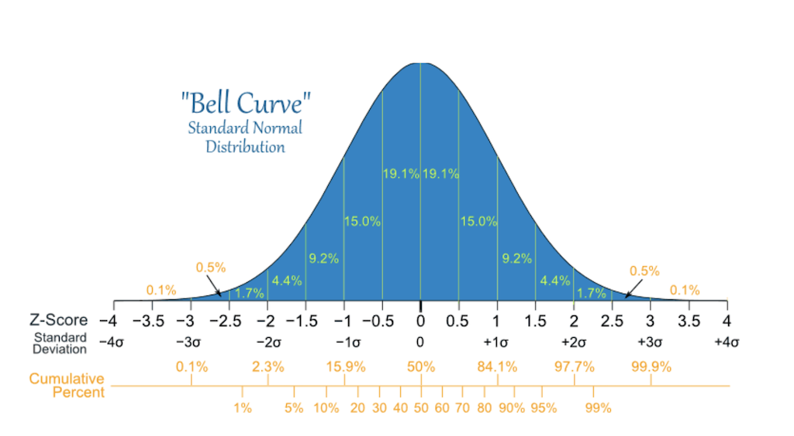]  
[[socialresearchmethods]](http://www.socialresearchmethods.net/kb/statinf.php)  

???
  
What is a normal distribution?
* A normal distribution is a specific bell-shaped pattern that data often naturally follows. Most values cluster around the middle (the mean), and values become increasingly rare the further you move away from it — symmetrically in both directions. Classic examples: human height, measurement errors, IQ scores.

It is defined by just two numbers: the mean (where the center is) and the standard deviation (how wide or narrow the bell is).

Why test for it in parametric statistics?
* Parametric tests (t-test, ANOVA, Pearson correlation, linear regression) don't just crunch your numbers — they make a bet about the shape of the data. Specifically, they assume your data (or the residuals) follow a normal distribution.
* This matters because the math behind these tests was derived from the normal distribution. The formulas for calculating p-values, confidence intervals, and standard errors are only valid under that assumption. If your data violates it, the test's output — including your p-value — can be wrong. Concretely:
    * The t-test assumes the group means are normally distributed
    * ANOVA assumes residuals are normal
    * Pearson correlation assumes both variables are normal
* If your data is strongly skewed or has heavy tails, a parametric test may tell you a result is significant when it isn't, or miss a real effect entirely.

The alternative: if normality fails, you either transform the data (e.g. log-transform), or switch to a non-parametric test (Mann-Whitney, Kruskal-Wallis) which makes no assumptions about the distribution's shape.

---
.header[Inferential Statistics]

## Parametric Statistics

For parametric tests to work, we have to assume some underlying statistical distributions in the data:

* Normal distribution
    * [W/S test](http://article.sciencepublishinggroup.com/pdf/10.11648.j.ajtas.s.2017060501.19.pdf)
    * [Jarque-Bera test](https://en.wikipedia.org/wiki/Jarque%E2%80%93Bera_test)
    * [Shapiro-Wilks test](https://en.wikipedia.org/wiki/Shapiro%E2%80%93Wilk_test)
    * [Kolmogorov-Smirnov test](https://en.wikipedia.org/wiki/Kolmogorov%E2%80%93Smirnov_test)
    * [D’Agostino test](https://en.wikipedia.org/wiki/D%27Agostino%27s_K-squared_test)
* Homogeneity of variance
    * [Levene’s test](https://en.wikipedia.org/wiki/Levene%27s_test)

---
template:inverse

# Quantification of the Effect

---
.header[Inferential Statistics]

## Parametric Statistics

> How can we compare the means of two independent groups?

---
.header[Inferential Statistics | Parametric Statistics]

## t-Test

The two-sample test analyses two sample means 𝜇1 and 𝜇2.  

???
  

* Under the assumptions that the data is normal distributed and the homogeneity of variance is given, we then can use, for example a t-test for comparing two populations. The two-sample test analyses two population means 𝜇1 and 𝜇2. The t stands for the difference between means in relation to the variation in the data. It describes the degree to which those means differ by chance alone.

--

> Is there a statistical difference between the means of the two samples?
  
---
.header[Inferential Statistics | Parametric Statistics]

## t-Test
  
 
* One-sample: Compare one group to a give value
* Unpaired: Compare two group means from independent groups
* Paired: Compare two group means from groups that are dependent

???

The t-test asks a simple question: is the difference between means large enough to be unlikely by chance? 

There are three versions depending on your data structure. 
* The one-sample t-test compares a single group against a fixed reference value — for example, testing whether a film's average rating differs from a neutral midpoint. 
* The unpaired t-test compares two independent groups — for example, ratings from two different audiences who never interact. 
* The paired t-test compares the same subjects under two conditions — for example, the same viewers rating a film before and after a director's cut, where each person serves as their own baseline. 

Choosing the wrong variant is a common error: if your groups are dependent, an unpaired test ignores the pairing structure and loses statistical power.

---
.header[Inferential Statistics | Parametric Statistics]

## t-Test

Most statistical software include p-value and t-test functions. It takes as input the raw data.

---
.header[Inferential Statistics | Parametric Statistics]

## t-Test

.left-even[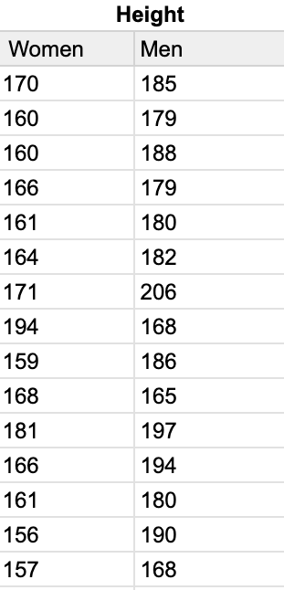]

.footnote[[Flandorfer, P. 2023. [Den T-Test verstehen und interpretieren mit Beispiel](https://www.scribbr.de/statistik/t-test/). Scribbr]]

???
  

* [Google Sheet](https://docs.google.com/spreadsheets/d/12dxoiJHh2vN-xhNrPD68xcMYDrZ8A_GTEbpZNP9Pxgc/edit?usp=sharing), [Tutorial](https://www.scribbr.de/statistik/t-test/), [Google Sheet Tutorial](https://docs.google.com/spreadsheets/d/1I3OARNrSNQ0lZqV4hnNj4yJZmBAaoB_jpgeN9-cKLog/edit#gid=997673686)

This example compares the heights of 15 women and 15 men. The null hypothesis is that there is no difference in mean height between the two groups.

--
.right-even[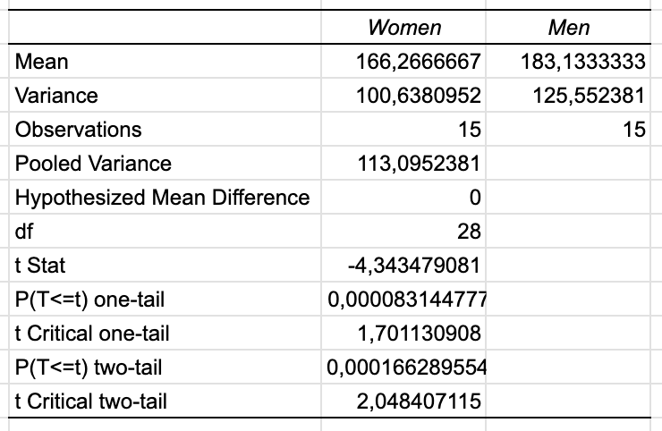]

???
  

Looking at the descriptive statistics first: women average 166.3 cm, men 183.1 cm — a raw difference of about 17 cm. The variances (101 vs. 126) are reasonably similar, which is why we can use the equal variances version of the test. These are pooled into a single estimate of 113, which represents the combined spread across both groups.

The t-statistic
* The t-statistic is a standardized distance. It answers: how far apart are the two means, expressed in units of "how much random variation we'd expect"?
* Think of it like a signal-to-noise ratio:
    * Signal = the actual difference between the means (183 - 166 = 17 cm)
    * Noise = the standard error, i.e. how much the means would naturally wobble around just from random sampling
* A t-statistic of -4.34 means the two means are 4.34 noise-units apart. The rule of thumb: the bigger the number, the more the difference stands out above the background noise. A t near 0 would mean the difference is swamped by noise and could easily be random.

Degrees of freedom
* You have 30 data points (15 + 15). But to calculate the variance — the noise — you first had to estimate two means, one for each group. Estimating each mean "uses up" one degree of freedom. So 30 - 2 = 28 free pieces of information remain for estimating variability. More degrees of freedom means a more reliable noise estimate, which slightly shifts where the critical threshold sits.

The critical value
* The critical value of 2.05 is the threshold your t-statistic must cross for the result to be considered statistically significant at the 5% level. It comes from the t-distribution with 28 degrees of freedom and essentially asks: how extreme would a t-statistic need to be if the null hypothesis were true and we only allowed a 5% false-alarm rate?

The t-statistic of 4.34 is more than double that threshold — so the signal is far too strong to dismiss as noise.

The p-value for the two-tailed test is 0.000166 — far below the conventional significance threshold of 0.05. This means: if the two groups truly had the same mean height, we would only observe a difference this large by random chance in about 0.017% of samples. That is extremely unlikely.

Conclusion: We reject the null hypothesis. The difference in height between women and men in this sample is statistically significant. The result holds for both the one-tailed and two-tailed test, with the two-tailed version being the appropriate conservative choice when we have no prior directional hypothesis.

---
.header[Inferential Statistics | Parametric Statistics]

## t-Test

Exemplary summary in a paper:

> The average height of women (M = 166.3; SD = 10.03) is lower than that of men (M = 183.1; SD = 11.21) with a significant difference of t(28) = -4.34 and p < 0.001.

.footnote[[Flandorfer, P. 2023. [Den T-Test verstehen und interpretieren mit Beispiel](https://www.scribbr.de/statistik/t-test/). Scribbr]]

???
  

* Bei unabhängigen Stichproben (beim Zweistichproben-t-Test) solltest du dabei auf jeden Fall folgende Parameter angeben:
* Mittelwert und Standardabweichung für beide Gruppen,
* t-Wert mit der Anzahl der Freiheitsgrade und
* Signifikanz (Sig.) des t-Tests.

---
.header[Inferential Statistics | Parametric Statistics]

## One-way ANOVA

???
  

* NOVA steht für Varianzanalyse (engl. Analysis of Variance) und wird verwendet um die Mittelwerte von mehr als 2 Gruppen zu vergleichen.
* Sie ist eine Erweiterung des t-Tests, der die Mittelwerte von maximal 2 Gruppen vergleicht.

* Many studies involve three or more conditions that need to be compared. Due to variances in the data, you should not directly compare the means of the multiple conditions and claim that a difference exists as long as the means are different. Instead, you have to use statistical significance tests to evaluate the variances that can be explained by the independent variables and the variances that cannot be explained by them. The significance test will suggest the probability of the observed difference occurring by chance. If the probability that the difference occurs by chance is fairly low (e.g., less than 5%), we can claim with high confidence that the observed difference is due to the difference in the controlled independent variables.

--
The comparison of more than *two* groups, based on *one* factor.

--
* The difference in height between soccer player, gymnasts, and volleyball players.
    * Factor: height in cm
    * Groups: soccer, gymnastics, and volleyball
--
* The the productivity of three or more employees based on working hours.
    * Factor: the productivity in working hours
    * Groups: three or more employees

???
  

* The one way Analysis of Variance (ANOVA) compares more than *two* groups, based on *one* factor. This means that there is only one independent variable.
* Collected soil uranium concentrations at three locations: Site A, Site B, and Site C.
    * Factor: the uranium concentration
    * Groups: three locations
* The hardness of four blends of paint
    * Factor: the hardness of paint
    * Groups: four blends of paint

---
.header[Inferential Statistics | Parametric Statistics]

## One-way ANOVA

Again, keep in mind that there are various requirements for the data:

* Normally distributed
* Homogeneity of variance
* Samples are independent

--

Then we test the following hypotheses:

H0: All means are equal.  
HA: *At least one* of the means is different from the others.

---
.header[Inferential Statistics | Parametric Statistics]

## One-way ANOVA

.center[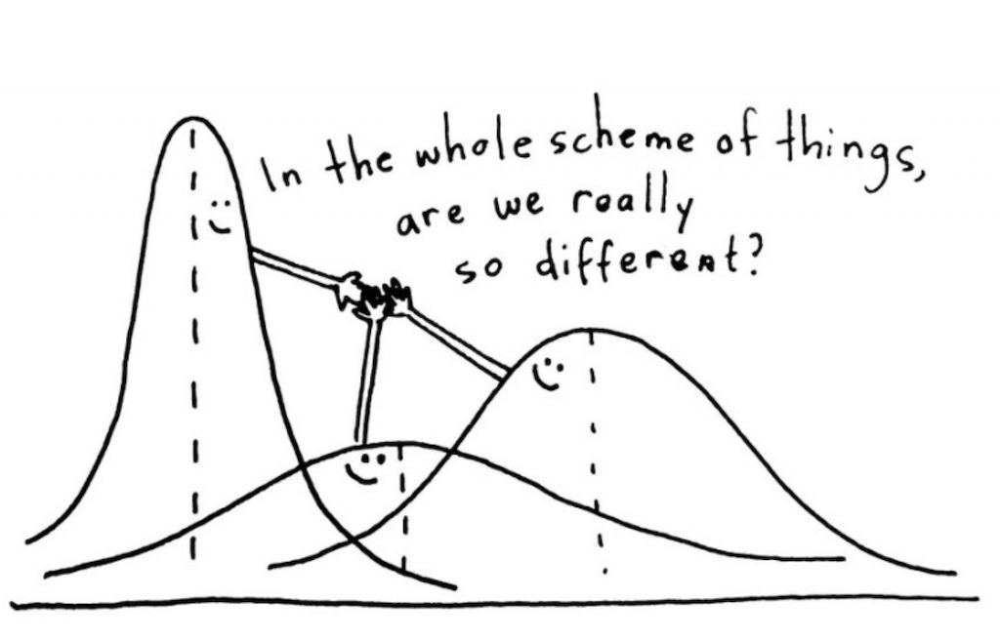]  

???
  

* https://docs.google.com/spreadsheets/d/1I3OARNrSNQ0lZqV4hnNj4yJZmBAaoB_jpgeN9-cKLog/edit#gid=1929990740
* The ANOVA test is based on the assumption that if the between group variance is much larger than the within group variance, then it seems more likely that the groups are different.  

---
.header[Inferential Statistics | Parametric Statistics]

## Two-way ANOVA

The [two way ANOVA](https://en.wikipedia.org/wiki/Two-way_analysis_of_variance) can compare more than two groups, based on *two* factors. 
  
 
This means that there are two independent variables, e.g., compare the employee productivity based on the working hours *and* some quality measure of their results.

???
  

* We will not get into this any further. If you need this test at some point, please investigate it properly.

---
.header[Inferential Statistics]

## Non-Parametric Statistics

--

Non-parametric methods make fewer assumptions about the data. They are also called *assumption-free* tests.

???
  

* E.g. if your data is not distributed normally.
* Although nonparametric tests are also called *assumption-free* tests, it should be noted that they are not actually free of assumptions. For example, the [Chi-squared test](https://en.wikipedia.org/wiki/Chi-squared_test), one of the most commonly used nonparametric tests, has specific requirements on the sample size and independence of data points. 
* Non-parametric analysis sacrifices the power to use all available information to reject a false null hypothesis in exchange for less strict assumptions about the data.
* Another important message to note about nonparametric analysis is that information in the data can be lost when the data tested are actually interval or ratio. 
* The reason is that the nonparametric analysis collapses the data into ranks so all that matters is the order of the data while the distance information between the data points is lost. 

---
## Choosing a Statistical Test

--

Planing the statistical analysis should be an integral part of designing a study!

--

 
You should answer the following questions in advance:

* What kind of data?
* How many independent variables? 
* Independent measure or repeated measure design?
* Is the data parametric or non-parametric?

???
  

* Depending on what you already know, you can easily find guidelines on which statistical test to chose, such as the following for example.

---
## Choosing a Statistical Test

.center[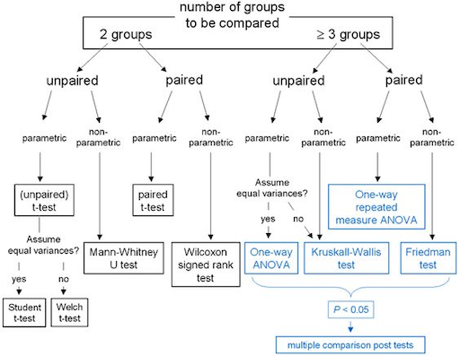]  

---

## Inferential Statistics

--

> Statistical analysis is a powerful tool that helps us find interesting patterns and differences in the data as well as identify relationships between variables, enabling us to make assumptions about a population. 
  
--
  
Before running significance tests, the data needs to be cleaned up, coded, and appropriately organized to meet the needs of the specific statistical software package. 

???
  

* The nature of the data collected and the design of the study determine the appropriate significance test that should be used.  
  
---

## Inferential Statistics
  

> Do not underestimate the effort you need to put into using methods of inferential statistics!

???
  

* If the data is normally distributed, parametric tests, such as a t-test or an ANOVA, are appropriate. When the normal distribution requirements are not met, nonparametric tests should be considered.  
* This section about inferential statistic left you probably with many open questions and you might now feel a bit scared about inferential statistic. Good 🙃... What I mean with this is that you must be aware of the complexity of inferential statistics and that you need to invest time and effort to use it properly. 
* The topic is, however, absolutely worth it, as it might lead to meaningful results. And ultimately, with this chapter as a starting point, giving you all the important keywords, and with a somewhat structured approach, inferential statistic is quite conquerable after all! 💪🏼

---
template:inverse

## The End

# 👋🏻
