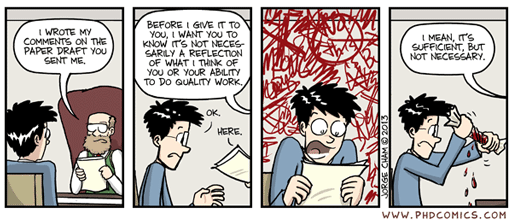

name: inverse
layout: true
class: center, middle, inverse
---

# Academic Methodologies

#### - Academic Writing -

  

### Prof. Dr. Lena Gieseke | l.gieseke@filmuniversitaet.de  

#### Film University Babelsberg KONRAD WOLF

---
layout:false

.center[ .imgref[[[imgur]](https://imgur.com/gallery/ex4PAUZ)]]

???
  

* Adam Savage is an American special effects designer, actor, educator, and television personality. He is best known as the co-host of the popular television series "MythBusters," which aired on the Discovery Channel from 2003 to 2016. Alongside Jamie Hyneman, Savage tested the validity of various myths, urban legends, and popular misconceptions through scientific methods and experimentation.

---
## Academic Writing

--
  
> Academic writing aims at presenting novel and relevant research as clearly as possible.  
  

--

 

* Text itself is the research (humanities)
* Text is reporting the research results (sciences)

---
template:inverse

# How To Start Writing

---
## How To Start Writing

???
  

* It is tremendously helpful to establish for yourself a routine that gets you into the flow of writing. 
* Writing can feel like a daunting task, but if you break it down it will appear more manageable. 

--
Writer’s block can be caused by

--
* Distraction
* Intimidation of the task

--
* Problem of expressions, not being firm in the language

--
* Too many ideas at the same time
* Not knowing what you want to say
* Half-formed ideas
* Missing knowledge

--

Most of these causes will vanish with **having a plan**!  

???
  

* As writing is all about getting into a *flow* of writing it is important to be in the right state of mind. Usually I will start with setting a time for how long I am going to write and with blocking all distractions such as emails for that time period. And with blocking, I mean literally blocking. For that I am using the [Focus app](https://heyfocus.com/?utm_source=focus_about) (there are countless similar tools), which prevents the opening of certain apps and websites for the defined time. This helps me to stick to the task and not to give up with the writing if it doesn't go as planned. Also, I personally like to start with having a quite detailed plan about what I am going to write. I define which part I am going to work on and what I hope to finish in that session. Then I will develop bullet points for each sections, which I try to make as detailed as possible. My goal is here *to separate the task of knowing what to write from the actual writing*! Bullet points are much easier to come up with and to structure than continuous text. 

---
## How To Start Writing

> The goal is to separate the task of knowing what to write from the actual writing.

---
## How To Start Writing

### *Find your process!*

???
  
* If I am completely stuck and even coming up with structured bullet points feels scary to me, I will start with a e.g. 20 min session to just write down what ever comes to my mind in regard to the tasks, be it text, bullet points, or jibberish. During that session, I try not to go back to anything that I have already written but let it be in which ever form and just continue to get something onto the page. Afterwards I go over everything I wrote and either distill bullet points from it or even already actual text. Of course this approach is quite time intensive. Also, it depends on your way af thinking and writing capabilities. I have met plenty of people that can produce beautiful, coherent text on the first go, starting with an empty page and not doing a detour over bullet points. I am not one of them. But the more I write, the more I am getting there.

The above is just my process and e.g. such an iterative approach might not fit you. I would like to encourage you to figure out your process! You do this ideally before you have to crunch out writings under a tight deadline.

In regard to specifically writing a paper, I recommend the following steps:

* (List your contributions)
* Define a leitmotif and a story
* Prepare an outline of the paper
    * Section and subsection headings
    * A few sentences about each (sub-) section
    * Plan figures, figure placeholders

???
  

* Do this very, very early
* This also sets your brain in motion to think about the topics

---
## How To Start Writing

In general,

--

 
start the writing with the most concrete parts, e.g. what you did, results...

--
  
 
...end with the more abstract parts, e.g. the discussion, outlook, abstract.

???
  

* Then start the writing with the most concrete parts about aspects you know well, e.g. your methodology, description of your steps, or your results. 
* These are usually the sections, which are easiest to write because you know exactly what to write. The more abstract parts, such as the discussion, the outlook and the abstract you should write last as with them you generate new content beyond the communication of your practical project.
* Now let's dive into what makes a paper a paper.

---

.center[].imgref[[[derntl]](http://dbis.rwth-aachen.de/~derntl/papers/misc/paperwriting.pdf)]

???
  

* Any academic writing follows overall this structure:

---
.header[Anatomy of a Paper]

.left-even[
* Title
* Teaser Image (if possible)
* Abstract
* Introduction
* Related Work
* Main Content
    * Algorithm, Setup, Study, etc.
    * Results
    * Evaluation
* Discussion
* Future Work
* Conclusion
* Acknowledgements
]

--
.right-even[

      
Reminder:
**[Anatomy of a Paper](./am_02_paperanatomy_slides.html)**
]

???
  

* In the context of computer science almost all paper follow the same structure, with minor differences in the structure of subsections and in the specific section titles.

Reminder

---
template:inverse

# Layout

---
## Layout

A paper should have a strong visual structure.  
  
* Section, sub-sections and bullet points
  
--
  
 
>  Good layout gives a reader an intuitive understanding of the paper on first glance.

???
  

* If in doubt, rather use a subsection to many than to few. Good layout gives a reader an intuitive understanding of the paper on first glance. My thesis advisor said to me for example that he can approximate a rough grade of a thesis, just by looking at its layout. And I think there is some truth to that. Also, I had it happened to me more than once that I thought I had structured my document well and it was given back to me with the comment that it needs more structure in the layout... A strong structure also helps to convey your content if there is a slight change that someone will only skim your text, e.g. for an application or expose where there are many submissions and some people are only superficially involved in the selection process.

I really can not give you any rules here to follow for structuring your text. It just depends on the content and its context. The only rule is: structure your text well with sections, subsections, bullet points and figures.  

For most paper submissions the venue will provide a set of rules for the text format and usually also a template for that. 

* You must stay within the given format, your paper might otherwise be rejected for just the wrong layout. Minor cheats, or let's call them tweaks, are ok as long as they are not really noticeable.

---
## Layout

Use figures such as drawings, diagrams, tables and graphs excessively.  

--

???
  

Ideally your whole paper is understandable just by going through the figures.

* As already mentioned, figures such as drawings, diagrams, tables and graphs are in the context of computer science and with that of course also HCI and CTech, crucially important for academic writing. Use figures excessively. Ideally your whole paper is understandable just by going through the figures. There are a couple of aspects to consider when working with figures:

--

* Numbered
* Have a caption
* Must be referenced in the text
* Match its position to the flow of the text

???

* They are numbered.
* They have a descriptive caption and a long description in the paragraph, where they are referenced. Keep in mind that good captions are not easy to write.
* If a figure is not discussed in the text, cut it.
* Try to match a figure's position to the flow of the text. The figure should be put close to the text, where it is references. This might be especially tricky in LaTeX (we are coming back to LaTeX).  

Using italics or bold font for emphasis are problematic in academic writing. I am struggling with that a little as I think they help to visually structure a text (and I use italics for emphasis in the scripts for example). But the rule in academic writing is to only use italics once for introducing a new term and to never use bold, except for header and titles and such.

Last but not least, make sure that everything in your paper is readable printed on paper! I always have problems with this because I like to use grays for figures and layout and grays that look super nice on screen oftentimes are not distinguishable printed out. The same problem applies when preparing a presentations and the difference between the slides on your screen and the slides on the projector.

Now that we have reflected on the beauty of the layout, let's think about the beauty of the language itself.

.center[] 

---
template: inverse

# Language

???
  

* Of course, correct spelling and grammar is a must in academic writing. If you want to improve your grammar (and yes, I know, I myself have still some issues here - did someone say commata?!) there is a universe of resources for that from our friend, the internet. I particularly like to check in with grammar test, such as the [grammar book](http://www.grammarbook.com/interactive_quizzes_exercises.asp).

*What do you think we need to look out for in terms of language?*

---
.header[Language]

## Precision

???
  

* One of the golden rules for the language of academic writing is - in all disciplines - to be precise. However, what preciseness means differs from discipline to discipline. In our context is means clean, somewhat simple language.

--
* Clean, simple language

???
  

*  The language must not give a reader any extra thinking to do - the content is difficult enough on its own. The value of the work is in your research project contributions and the language should make those aspects clear, not obscure what you did with complicated language. You will notice for yourself that some writings try to hide weak results, thoughts, etc. behind complex language.

--
* Rule of thumb: use as few words as possible

???
  

* When working with native English speakers as a native German speaker the aspect of simple language is especially difficult. Simple German is in comparison to simple English still ten times more complex. Whenever I work with native English speakers they still simplify my sentences... 🤬 (the learning never stops...).

The website [daily writing tips](https://www.dailywritingtips.com/) describes the following helpful [techniques for more precise writing](https://www.dailywritingtips.com/10-techniques-for-more-precise-writing/)

---
.header[Language | Precision]

## Avoid Vague Nouns  

* Don't: “She is an expert in the area of international relations.”  
* Do: “She is an expert in international relations.”  

--

 
Phrases formed around general nouns such as *aspect*, *degree*, and *situation* clutter sentences.  

---
.header[Language | Precision]

## Verb Phrases to Simple Verbs  

* Don't: “The results are suggestive of the fact that tampering has occurred.”  
* Do: “The results suggest that tampering has occurred.”

--

 

Identify the verb buried in a verb phrase and omit the rest of the phrase.  

---
.header[Language | Precision]

## Avoid Expletives  

* Don't: “There are many factors in the product’s failure.”  
* Do: “Many factors contributed to the product’s failure.”

--
  
 
  
Don’t start sentences with “There is,” “There are,” or “It is.”

---
.header[Language | Precision]

## Use Words, Not Their Definitions  

* Don't: “The crops also needed to be marketable so that families would be able to sell any yields that exceeded what they personally required.”  
* Do: “The crops also needed to be marketable so that families would be able to sell any surplus.”

--
  
 

Replace explanatory phrases with a single word that encapsulates that explanation.  

---
.header[Language | Precision]

## Eliminate Prepositional Phrases

* Don't: “The decision of the committee is final.”  
* Do: “The committee’s decision is final.”

--
  
 
Replace “(noun1) of the (noun2)” phrasing with “(noun2)’s (noun1)” phrasing.

---
.header[Language | Precision]

## Use Active Voice  

* Don't: “The meeting was seen by us as a ploy to delay the project.”  
* Do: “We saw the meeting as a ploy to delay the project.”

--
  
 
When a sentence includes *be* or any other copulative verb, such as *is* or *are*, recast the sentence to omit the verb.

---
.header[Language]

## Gender-Inclusive Language

Gender inclusive language is fully embraced in the academic world.

--

 
  
Overall, the best solution is to make the nouns and pronouns plural.  

* Don't: A student who loses too much sleep may have trouble focusing during [his/her] exams.  
* Do: Students who lose too much sleep may have trouble focusing during their exams.

---
template:inverse

# Style

---
## Style

In academic writing you must avoid

* Emotional language
* Flowery language
* Superlatives

???
  

* Overall though, writing style simply is subjective. If you give your paper to experienced writers they will be affected by their personal style and will give you many, many corrections. These corrections might not improve errors but might just try to make the text match more the personal writing style of the corrector. Take in the feedback, reflect on it but also stand your ground if your personal writing style is different.

---
## Style

.center[] .imgref[[[phdcomics]](http://www.phdcomics.com/comics/archive.php?comicid=1576)]

---
.header[Paper Sections]

## Writing A Paper - Final Thoughts

Repeat yourself while never repeating text...

--

A common mistake is to repeat the same phrases, sentences etc.  
  
--

 
However, you have to bring up your main points over and over again e.g. to lead the reader through your paper. 

---
.header[Paper Sections]

## Writing A Paper - Final Thoughts

In academic writing, everything you say must directly be proofed in some form. 

???
  

* This is something that students who are new to academic writing often do incorrectly.  

Some problematic examples might look like as follows:

--
* "The problem is difficult."

???
  

* *Difficult for whom? Believed by you? Believed by others? Proven by someone? Difficult in what sense? Difficult when done blindly? Difficult when done without a brain? Difficult for your cat?*

--
* "The method is fast."

???
  

*Fast in comparison to what? Faster than a snail? Faster than the speed of light? Faster than your cat?*

--
* "The high quality of the results..."
* "The results look good."

--
* "As it can be seen…", "It has been shown..."  
  
--
  
 
Question all your statements and see **if the text answers to everything**. 

???
  

* For this also see the section about citations.

Now, that we know what to write, let's talk about the look, meaning the layout of a paper. As we all know, looks are important - that is just human nature. Unfortunately the world of paper writing is not as progressive as our world is (hopefully) slowly changing to the appreciation of all shapes, sizes and colors, moving away from standards, appreciating diversity and individuality. A beautiful paper, however, very much needs to follow standards. But of course - as in real life - the real beauty of a paper comes from within, and if the content of the paper is rubbish, the layout can not fix that.

---
template:inverse

### The End

# 👋🏻
