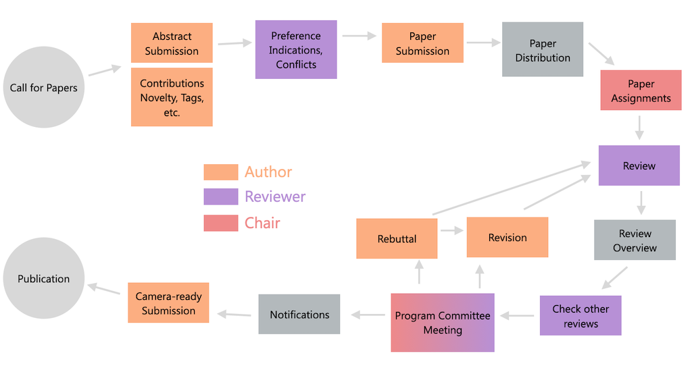
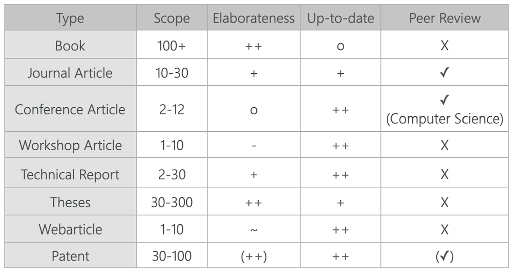

name: inverse
layout: true
class: center, middle, inverse
---

# Academic Methodologies

#### - Academic Publishing -

  

### Prof. Dr. Lena Gieseke | l.gieseke@filmuniversitaet.de  

#### Film University Babelsberg KONRAD WOLF

---
layout: false

## Academic Publishing

--

The main motivations for academic publishing are

--
* Documentation of research results

--
* Quality Assessment

--
* Reproducibility

--
* Contextual integration

---

## Academic Publishing

Publications are required for

--
* Scholarships
* Grants
* Jobs in academia
* Research positions
* ...

???
  

* Bibliometrics is the use of statistical methods for quality measures to to analyse

* What is one of the main methods for quality assessment?

---
.header[Academic Publishing]

## Quality Assessment

???
  

* What is the common scientific approach to a quality assessment?
* 
--

Peer review is based on the technique that people from the same research community with similar competencies and expertise evaluate the work of a peer.  

--

 
It functions as a form of self-regulation by qualified members of the community.

???
  

* https://github.com/ctechfilmuniversity/conference_acsfub.github.io/blob/master/review_template_preview.txt

---
.header[Academic Publishing | Quality Assessment]

## Peer Review

.center[]

---

## Publications Types

???
  

* Which different publication types do you remember with which properties

--

.center[]

---

## Bibliometrics

???
  

* What are Bibliometrics?

--

Bibliometrics is the use of statistical methods for quality measures to analyse  

* Journals
* Conferences
* Authors

Impact factor (IF), h-index, i10 index

???
  

* The impact factor (IF) or journal impact factor is an index that reflects the yearly average number of citations that articles published in the last two years in a given journal received. 
* The h-index is an author-level metric that attempts to measure both the productivity and citation impact of the publications of a scientist or scholar. 

---
.header[Academic Publishing]

## Problems With The Current System

???
  

* What can be seen as the main problems?

--

* Accessibility
* Quality

---
.header[Academic Publishing]

## Problems With The Current System

* Accessibility
    * Free labor from universities / large margin for private publishing houses
    * Access fees are high
    * Alternative: open access strategies
--
* Quality
    * Review results might be close to random
    * Only positive results are publishable

???
  

* A possible solution are so called *open access* venues. The general idea is that the authors themselves pay for publications and to access those papers is free.  

---
template: inverse

# Academic Careers

---
## Is a Phd For You?

--

> Did you enjoy working on your bachelor / master thesis?  
  
--

* Teaching
* Self-organization
* Lose working times 

---
## Is a Phd For You?

"Soft skills" are equally important as research skills...

--

* Endurance
* Adaptation
* Self-organization
* Handling of pressure

---
#### Is a Phd For You?

* SG 2013 - CANCELLED
* PG 2013 - REJECT
* EG 2014 - REJECT
* EGSR 2014 - ACCEPT
* CVMP 2014 (short) - ACCEPT
* BIG DATA 2014 (short) - ACCEPT
* DFG Sachbeihilfeantrag 2014 - ACCEPT
* CA 2015 (short) - ACCEPT
* SG 2016 - REJECT
* UIST 2016 - REJECT
* PATENT P6060-US - ACCEPT
* EG 2017 - REJECT
* CA 2017 - ACCEPT

???
  

* My PhD had the following, mediocre but quite normal, submission history:

---
## Is a Phd For You?

Some excerpts of the reviews I got over time... Ouch! 😔 

* I was completely **disappointed by** […]
* The results of this paper are **not reasonable**.
* This paper is disappointing as it **lacks novelty**.
* […] the paper describes a longer list of minor changes to an existing algorithm. […] reuses a lot of established concepts […] **does not seem to lead to fundamental new insights** or **significant technical challenges**.
* This paper does not seem to advance the state-of-the-art in any way. 
*  […] would **not** consider the paper **a major practical break-through**.
* I'm not very enthusiastic about the paper […]

---
## Is a Phd For You?

Some excerpts of the reviews I got over time... Ouch! 😔 

* […] make the results **hardly meaningful**.
* I am **skeptical of the value** of the presented studies.
The problem addressed in the paper **does not seem very new** and the proposed algorithms also **do not offer any particular insights**. Therefore, I think this paper **is not significant enough**.
* The manuscript also fails to present the (rather simple) technique in a concise (and correct) way. 
* […] **makes no sense**.

---
## Financing a Phd

* Mitarbeiter*innen Stellen
    * Include other tasks such as teaching and administration
    * Not always full-time
    * Only very sparsely available
    * Usually very open topic-wise

--

* "Kolleg" scholarships
    * Focus on research
    * 1000-1500 Euro a month, but no taxes
    * Have a main topic

---
## Financing a Phd

* Institutional scholarships
    * Political
    * Religion
    * Social
    * Topic-based

???
  

---
## Phd Topics

--

* The topic and research area should play to your strength in terms of methodology

--

* Controversial opinion: You do not need to be *passionate* about your topic

--

> Any topic becomes interesting when you get into the details...

...if you are a nerd!

---
## Phds at Filmuni
  
* Academic 
    * Media Studies
    * Doctor of Philosophy (Dr. phil. )

--

* Academic-artistic 
    * Screenwriting/Dramaturgy
    * Film Culture Heritage
    * Production
    * Doctor philosophiae in artibus (Dr. phil. in art.)

???
  

Planned
* Academic 
    * Computer Science / Creative Technologies
    * Doctor of Engineering (Dr.-Ing.)
* Academic-artistic Creative Technologies
* Dr != Ph.D.

---
## After a Phd: Industry

* As further qualification
* In a research department

---
## After a Phd: Academia

* Post-doc
    * Research publications
    * Write grants and research proposals
    * Guide Phd students
    * Project / group leader
    * 3 stops in 2 countries
    * Max. 6 years

---
## After a Phd: Academia

* Post-doc
* Junior Professor
    * Tenure-track vs. non tenure-track (do not!)

---
## After a Phd: Academia

* Post-doc
* Junior Professor
* Professor
    * W2, W3

???
  

---
template:inverse

### The End

# 👋🏻

