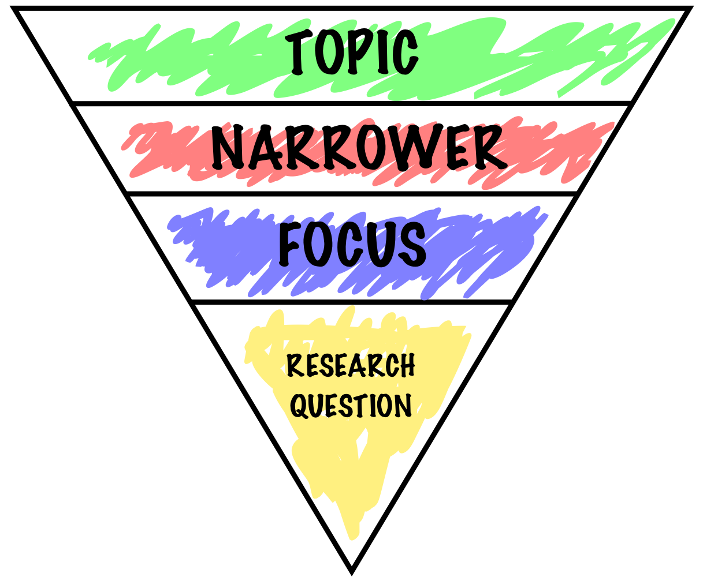

name: inverse
layout: true
class: center, middle, inverse
---

# Academic Methodologies

### Prof. Dr. Lena Gieseke | l.gieseke@filmuniversitaet.de  

#### Film University Babelsberg KONRAD WOLF

---
layout:false
## Today

--
* Recap
    * ACS FUB
    * Anatomy of a Paper

--
* Paper Topics

--
* Literature
* Reading Strategies

---
## ACS FUB 2026

--

Requirements

* The submission of a (short-) paper
* Writing and receiving reviews
* The presentation of your work in front of your peers

---
.header[ACS FUB 2026]

## Deadlines

All deadlines (all dates 20:00 GMT) are hard. Late submissions are not accepted.

* 25.09.26: Abstract Due
* 30.09.26: Paper Due
* 02.10.26: Review Start
* 16.10.26: Review Due
* tba: Author Notification
* tba: Conference

Unfortunately deadline extensions due to illness will be difficult. 

???

If you get sick close to the deadline, please get in touch with me asap.

* Any questions regarding the overall course setup?

---
## Anatomy of a Paper

???

* In the context of computer science almost all paper follow the same structure, with minor differences in the structure of subsections and in the specific section titles.

The structure of a paper is as follows:

--

.left-even[
* Title
* Teaser Image (if possible)
* Abstract
* Introduction
* Related Work
* Main Content
* Future Work
* Conclusion
* Acknowledgements
]

--

.right-even[
* Main Content:
    * Algorithm, Setup, Study, etc.
    * Results
    * Evaluation
    * Discussion
]

---
## Aknowledging the Use of AI

Examples from current Master Theses

---
.header[Aknowledging the Use of AI]

### Janne Volz 
#### Generative KI im theoretisch-analytischen Teil

Im theoretisch-analytischen Teil wurden generative KI-Systeme (insbesondere ChatGPT und NotebookLM)
ausschließlich als unterstützende Arbeitswerkzeuge eingesetzt. Die Nutzung beschränkte sich auf:

* Orientierung bei der Literaturrecherche (Auffinden möglicher Quellen und Schlagwörter),
* Erste Strukturierung von Themenfeldern,
* Zusammenfassungen bereits gelesener Texte zur Arbeitsorganisation,
* sprachliche Glättung einzelner Formulierungen.
  

---
.header[Aknowledging the Use of AI]
### Janne Volz 
#### Generative KI im theoretisch-analytischen Teil

Die Systeme wurden nicht zur eigenständigen Entwicklung wissenschaftlicher Argumente, zur Interpretation von Quellen oder zur Ersetzung eigener Lektüre verwendet. Sämtliche inhaltlichen Argumentationen, Bewertungen, Schlussfolgerungen und theoretischen Einordnungen wurden vom Autor eigenständig erarbeitet und verantwortet.  
  
 
Alle in der Arbeit enthaltenen Zitate stammen aus tatsächlich konsultierten Quellen. Es wurden keine KI-generierten Scheinzitate oder ungeprüften Literaturangaben übernommen.
  

---
.header[Aknowledging the Use of AI]
### Janne Volz 
#### Abgrenzung und Verantwortung

Generative KI-Systeme wurden nicht als Autor*innen dieser Arbeit eingesetzt. Es erfolgte keine ungeprüfte Übernahme von KI-generierten wissenschaftlichen Textpassagen. Alle verwendeten Inhalte wurden vom Autor geprüft, bearbeitet und in den eigenen Argumentationszusammenhang eingeordnet.  

 

Die Verantwortung für Inhalt, Argumentation, Auswahl und Bewertung der verwendeten Quellen sowie für sämtliche Schlussfolgerungen der Arbeit liegt vollständig beim Autor.  

 

Diese Transparenzangaben ergänzen die am Ende der Arbeit beigefügte eidesstattliche Erklärung und stehen nicht im Widerspruch zu dieser.

---
.header[Aknowledging the Use of AI]
### Tim Rumpf
#### Note on the use of AI

For the purposes of transparency, I disclose the use of AI tools in the production of this document. The specific tools employed included Gemini 2.5 Pro, GPT-5 and DeepL Write. This use was assistive and did not substitute for my own intellectual contribution. Specifically, AI was used as a language assistant to refine and optimize the expression of my own ideas in the theoretical part. In the practical part, it was also used as a debugging aid to help identify errors in code. Human oversight was maintained at all times. All AI-generated outputs were critically evaluated, and I am solely responsible for the final selection, adoption, and verification of all content.

---
.header[Aknowledging the Use of AI]
### Marco Braune
#### Declaration of authorship

I hereby declare that the thesis submitted is my own, unaided work, completed without any external help. Only the sources and resources listed were used. All passages taken from the sources and aids used, either unchanged or paraphrased, have been marked as such.
  
 
Where generative AI tools were used, I have indicated the product name, manufacturer, the software version used, as well as the respective purpose (e.g. checking and improving language in the texts, systematic research). I am fully responsible for the selection, adoption, and all results of the AI-generated output I use.

---
template:inverse

# Your Paper

---
## Your Paper

.left-even[
.center[]

.footnote[Image: [Chad Flinn](https://malat-webspace.royalroads.ca/rru0054/what-makes-a-good-research-question/)]]

---
## Research Question

--

> A question that a research project sets out to answer.  
  
---
## Research Question

> An academic story that a you set out to tell in a structured manner.  
  

--
* Focus on a single problem

--
* As specific and narrow as possible

--
* Complex enough to develop the story over the space of a paper

--
* Feasible to answer within the time-frame and practical constraints

???

> The research question is also the question why you should delight the world with another pile of printed paper.  
  
.caps[Winter, Wolfgang]. 2005. **Wissenschaftliche Arbeiten schreiben**. 2nd Ed. Frankfurt: Redline Wirtschaft.

---
## Your Paper

.left-even[
.center[]

.footnote[Image: [Chad Flinn](https://malat-webspace.royalroads.ca/rru0054/what-makes-a-good-research-question/)]]

.right-even[
> You need to narrow your topic and make find a specific aspect that interests you.

]

???
A research question is not the same as the research problem — the problem is the broader context of relevance (political, ethical, scientific). The RQ is one focused, answerable aspect of it.

---
## Types of Research Questions

???
Four orientations — each answers a fundamentally different kind of question.

| Type             | Core Question                      | Temporal Focus |
| ---------------- | ---------------------------------- | -------------- |
| **Descriptive**  | What is X like?                    | Present / Past |
| **Explanatory**  | Why / how does X relate to Y?      | Past / Future  |
| **Evaluative**   | How good or effective is X?        | Present        |
| **Constructive** | How can X be achieved or improved? | Future         |

--

* Descriptive: *What is...like?*

--
* Explanatory: *What are the consequences of...?*

???
E.g. of an action

* Cause-effect relationship: What are the consequences of an action? 
* *Why do... differ?*
* *Why ... changed ...?*
* Why do companies differ in terms of staff development?
* Why hasn’t labor mobility in the EU changed since 1990?

--
* Evaluative: *How is...?*

???

* Evaluative
    * How can one condition be assessed in the light of specific criteria? 
    * *How can ... be assessed regarding to ...?*
    * *Are... more satisfied after...?*
    * How can pupil-centered teaching in English be assessed in the light of formal performance dimensions?
    * Are teachers more satisfied after having developed school profiles?

--
* Constructive: *How can we...?*

???

* Constructive
    * What will happen in the future? 
    * What kind of changes are to be expected? 
    * *How will ... change?*
    * How will staff development in a particular line of business change over time?
    * How will labor mobility in the EU change in the next 5 years?

* Creation
    * Which measures are useful to solve a particular problem? 
    * *How can we...?*
    * *What strategies can...?*
    * How can we ensure population balance in the future?
    * What strategies can companies use to be successful in the Chinese market?

---
.header[Types of Research Questions]
## Descriptive - Mapping Reality

Characterizes a case, phenomenon, situation, or development without making claims about causes or effects.

--

* *What are the characteristics of X?*
* *How has X changed over time?*
* *How does X experience Y?*

???
* How do media artists integrate generative AI tools into their existing, creative workflows?
* How have the tasks and responsibilities of the cinematographer changed on LED volume productions?

It means the research question only asks what something looks like, not why it is that way.
  
Purely descriptive ≠ trivial. Strong descriptive studies are foundational — you cannot explain what you have not yet accurately described.  

A descriptive question like "What does AI use in film production look like?" documents practices, patterns, and characteristics. It does not claim that X causes Y or that one variable influences another. The moment you ask "Why do filmmakers adopt AI tools?" or "What effect does AI have on crew size?", you have crossed into explanatory territory.
Short version: describe the landscape, don't explain the weather.

---
.header[Types of Research Questions]
## Explanatory — Understanding Causes

Investigates why things happen, how they relate, and how they might develop.

???

Investigates relationships, mechanisms, or causal structures — including forward projections.

--

* *Why does X happen?*
* *What is the relationship between X and Y?*
* *What is the role / impact of X on Y?*
* *Why do X and Y differ?*
* *How will X change over the next N years?*

???
Covers both retrospective causality ("why has X changed?") and prospective dynamics ("how will X evolve?"). Outlook-type questions belong here — they extrapolate from causal understanding.

* Why do audiences report stronger recall of interactive installations than of passive screen-based works?

---
.header[Types of Research Questions]
## Evaluative — Judging Against Criteria

Assesses a condition, method, or outcome relative to defined standards or values.

--

* *What are the advantages and disadvantages of X?*
* *How can X be assessed in light of criteria Y?*
* *Are practitioners more satisfied after intervention X?*

???
Evaluation requires explicit criteria — otherwise it is just opinion. The criteria themselves can be a methodological contribution.

* How do AI-assisted screenwriting tools support narrative coherence and writer-reported creative agency?

---
.header[Types of Research Questions]

## Constructive — Developing Solutions

Develops strategies, models, or interventions to address a concrete problem.

* *How can X be achieved or implemented?*
* *What strategies improve X?*
* *How can X be used in context Y?*

???
Constructive questions are common in applied and practice-based fields — including Creative Technologies. They often follow from evaluative findings: first assess the problem, then design the fix.

* How can motion-capture data be used for controlling the parameter of a particle system in live audiovisual performance?

---
## Research Question

In my experience, the most common problems with student papers are:

--
* The question / storyline is **too general**

--
* The question includes **poorly defined** terms

???
  

*  Unfocused and too broad
    *  "How does technology affect art?"
    *  "What is the future of film?"
    *  "How do audiences experience digital media?"
* Poorly defined
    * "Why do some interactive works feel more meaningful?"
    * "How can AI make creative processes better?"
    * "What makes a generative artwork successful?"

---

## Your Paper

Your topic ideas?

???
TODO: briefly describe 1-3 topic choices, everybody can suggest a more narrow questions

--
  
 

*Next*: Write down specific questions 

* Why are you interested in that question?
* How could you answer that question?

---
template:inverse

### The End

# 👋🏻
