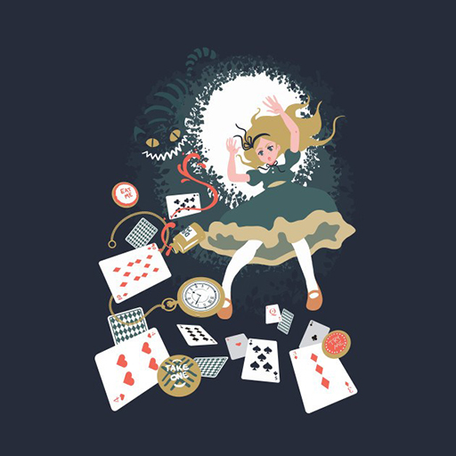
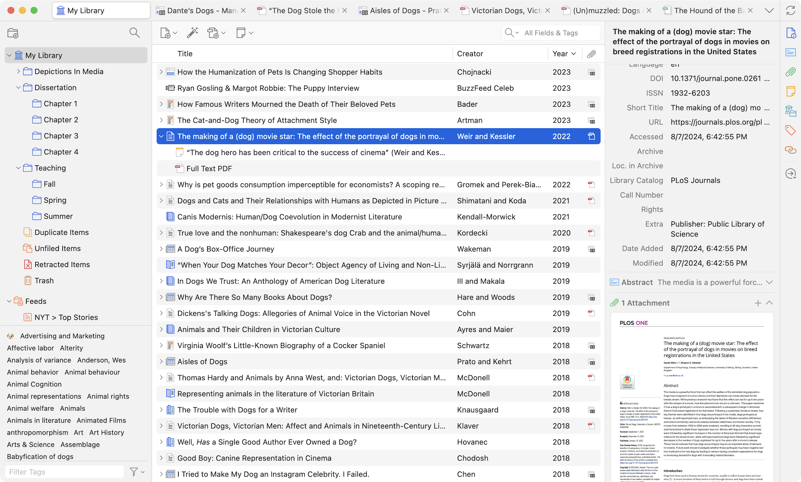
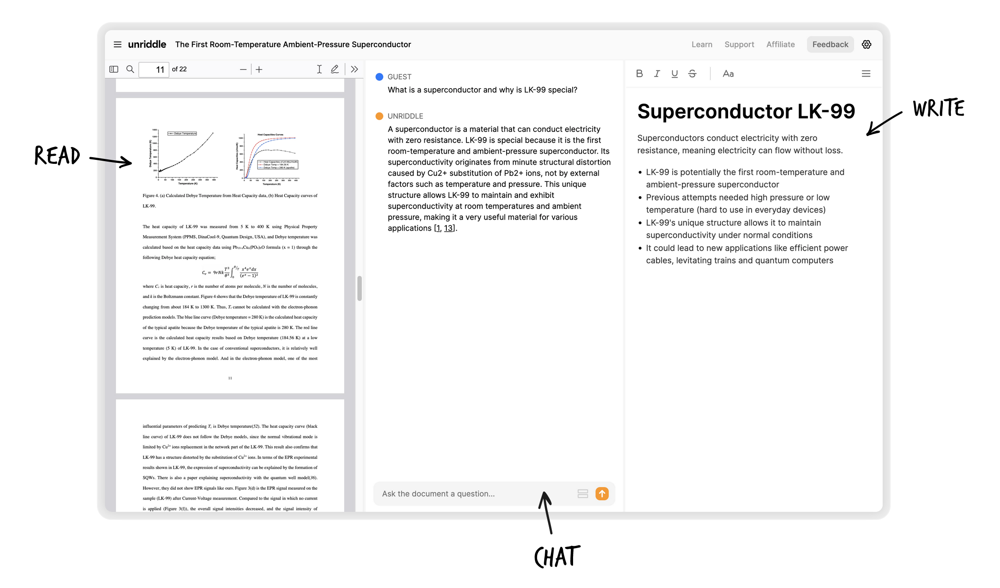

name: inverse
layout: true
class: center, middle, inverse
---

# Academic Methodologies

#### - Session 3 -

  

### Prof. Dr. Lena Gieseke | l.gieseke@filmuniversitaet.de  

#### Film University Babelsberg KONRAD WOLF

---
layout:false
## Today

--
* Check-In Paper Topics

--
* Recap Literature & Reading Strategies

--
* What is research?

---
layout:false

## Check-In Paper Topics

* Open questions?

--

* Next step: narrowing rough question versions to three choices

---
template:inverse

# Literature

---
.header[Literature]

## Topics

* Searching
    * Engines
    * Digital Libraries
* Strategies
    * Searching
    * Collecting
    * Reading
* Management Tools

---
.header[Literature]

## Search Strategies

--
* Keywords
* Years
* Authors
* References in papers
    * Follow the citations in the paper
* Venues
    * Journals, conferences that fit topic-wise

---
.header[Literature]

## Search Strategies

--

* Broad vs. deep

--

* Fundamentals vs. recent advancements / novelty
    * E.g. citation counts or best paper vs. year

--

* Applied vs. basic

---
.header[Literature]

## Search Strategies

> It is not an accomplishment to find literature. Reading the right one really is!

.center[].imgref[[[theshirtlist]](https://www.theshirtlist.com/down-the-rabbit-hole-t-shirt-2/)]

---
.header[Literature]

## Collection Strategies

--
.left-even[
* Set yourself a time frame

]
---
.header[Literature]

## Collection Strategies

.left-even[
* Set yourself a time frame
* Decide on the search strategy
]

---
.header[Literature]

## Collection Strategies

.left-even[
* Set yourself a time frame
* Decide on the search strategy
* Have a setup 
]
--
.right-even[
* Which references to save?
* How, where and under which name to save?
* How to come back to the reference (assign a prioritization)?
  
]
  

???
  

* Set yourself a time frame, otherwise hours over hours might just pass by.
* Decide on the type of serach you want to do: narrow vs. broad. What is it you want to archive with this search? Get an overview? Get specific related work for an algorithm?
* For a more narrow search, be disciplined about staying on track of certain keywords, for example.
* Maybe decide on a number of papers you want to save, which should be connected to the actual time you have to read them.
* Have a setup ready that decides
    * how to decide which papers to save,
    * how (pdf vs. online link?), where and under which name to save papers,
        * E.g. I save paper as `firstauthorlastname_year_firstlettersofthefirstthreewordsofthetitle.pdf`, such as `wong_1998_cgf.pdf`
    * wether to give them directly a prioritization on what to read next, and
    * how to make sure that you come back to these papers and actually read them.

---
.header[Literature]

## Collection Strategies

.left-even[
* Set yourself a time frame
* Decide on the search strategy
* Have a setup  
  
  
> Be disciplined with the search!
]

.right-even[
* Which references to save?
* How, where and under which name to save?
* How to come back to the reference (assign a prioritization)?
  

]
  

---
.header[Literature]

## Collection Strategies

--
* Read the title

--
* Read the abstract

--
* Read the list of contributions (if there)

--
* Look at the figures one by one and read their captions

--
* Look at additional materials such as a project page or supplemental videos

--

> The more decisions you make about the reference right away, the more time you save later on.

???
  

* The more decisions you make about the paper right away (whether to save, read, read first, tags,... ?), the more time you save later on, when you have to once again remember what the paper was about and whether you should read it.

---
.header[Literature]

## Management Tools

---
.header[Literature | Management Tools]

## [Zotero](https://www.zotero.org/)

.center[ .imgref[[[Zotero]](https://www.zotero.org)]]

???

> Any suggestions?

---
.header[Literature | Management Tools]

## [Anara](https://anara.com/)

.center[.imgref[[[Anara]](https://anara.com/)]]

---
.header[Literature]

## Management Tools

Ideally, you should have a system, which tells you what to read next.  
  
--

 

Tags / Folder

* Priority
* Topics
* Your assessment

???
  

* Reading many papers makes you a better researcher
* Also across topics

---
.header[Literature]

## Reading Strategies

Read with intention

--
* *Why are you reading this paper?*

--
* *What is it that you want to know and gain from reading this paper?*

---
.header[Literature]

## Reading Strategies

Fong, P. W. L. 2004. **How to Read a CS Research Paper?** Unpublished manuscript.  
  
Keshav, S. 2007. **How to read a paper**. ACM SIGCOMM Computer Communication Review, 37(3), 83–84. (Revised February 17, 2016.)

???
  

* Homework readings

---
template:inverse

### The End

# 👋🏻
