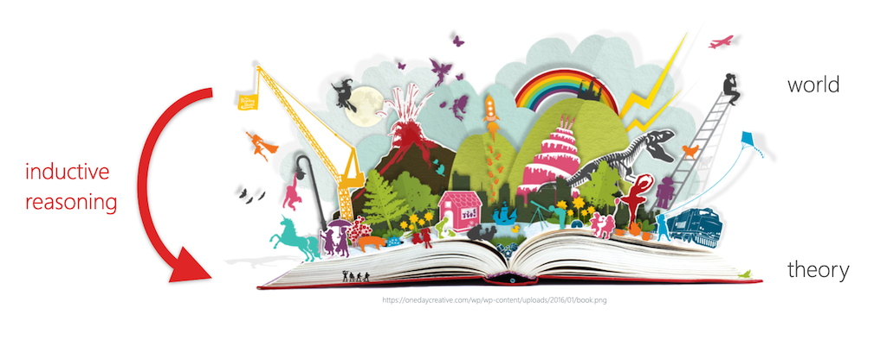
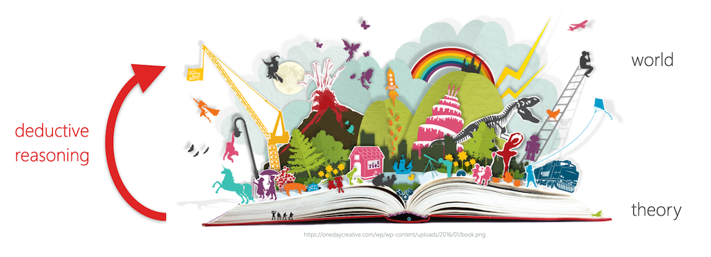
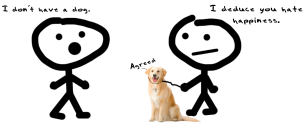

name: inverse
layout: true
class: center, middle, inverse
---

# Academic Methodologies

#### - Session 5 -

  

### Prof. Dr. Lena Gieseke | l.gieseke@filmuniversitaet.de  

#### Film University Babelsberg KONRAD WOLF

---
layout:false
## Today

--
* Check-In Paper Development

--

* Re-cap Reasoning
* Quantitative & Qualitative Reasoning

--

* Qualitative Research

---
layout:false

## Paper Development

???

* references
* status
* open questions

--

Describe in max. 1500 characters, what your paper investigates. Be specific, well-defined and narrow. If you have a research question even better. Integrate all relevant references you have have so far into the text.
  
--

* **May 28th**: This version can still be moderately adjusted, also based on the feedback I give you. If you still have open questions that you want feedback on, you can indicate these in your first submission.
* **June 11th**: The final submission 
  

---
template: inverse

### Recap
  
## Reasoning

---
layout: false

.footnote[[Francisco Goya - ***The sleep of reason produces monsters***, 1799.]]    

???
  

Reasoning can be done well and it can be done badly and it can be done correctly or incorrectly. 

What is the difference between good and bad reasoning. What is the spectrum?

---
.header[Reasoning]

## Logic

Logic is the discipline that aims to distinguish good reasoning from bad. 
  
 
  
> Logic is the study of how ideas reasonably fit together. 

???
  

* When you apply logic, you must be concerned with analyzing ideas and arguments by using reason and rational thinking, not emotions or mysticism or belief.

All academic disciplines employ logic

* to evaluate evidence, 
* to analyze arguments, 
* to explain ideas, and 
* to connect evidence to arguments. 

There are a variety of different types of logical reasoning and methods for it. 
  
Hence, there are many approaches to the logical enterprise. 

* A logic must formulate precise standards for evaluating reasoning and develop methods for applying those standards to particular instances.
* We will have a brief look into different standards that follow the core principle of applying logic.

???
  

* What is inductive reasoning?

---
.header[Reasoning | Inductive Reasoning]

## Empiricism

--

> All our knowledge is based on our experiences in the world.

???
  

* One could intuitively say, that all our knowledge is based on our experiences in the world. 
* Hence, in order to come up with truth and knowledge, we need to have a closer look into our experiences in the world. That is what the *[Empiricism](https://en.wikipedia.org/wiki/Empiricism)* philosophy of science assumes.
* Empiricism considers knowledge to come only or primarily from (sensory) experience. 
* Historically, empiricism relates to the concept of [tabula rasa](https://en.wikipedia.org/wiki/Tabula_rasa) (*blank slate*), according to which the human mind is *blank* at birth and develops its thoughts only through experience. This theory denies that humans have innate ideas and this image dates back to Aristotle.

---
.header[Reasoning]

## Inductive Reasoning

.center[]

???
  

> An inductive argument is an argument which conclusion is supposed to follow from its premises with a high level of probability. 

* Formulate general statements or laws based on a number of observations of recurring patterns.
* It derives novel theories from the world.
* Specifically...

  
* which means that although it is possible that the conclusion doesn’t follow from its premises, it is unlikely that this is the case. [[37]](https://viva.pressbooks.pub/letsgetwriting/chapter/what-is-logic/)
* There are also different subtypes of inductive reasoning but for us it is enough to grasp the general concept.

  

---
.header[Reasoning]

## Absolut Truths

*From what kind of observations of the world can we derive absolut truths?*  

???
  

* Addressing these counter arguments to (also called *naïve*) Empiricism, *[Critical Rationalism](https://en.wikipedia.org/wiki/Critical_rationalism)* (or *Neo-positivism*) states that there is no absolute truth, only *hypotheses*.
* One of the 20th century's most influential philosophers of science, [Karl Popper](https://en.wikipedia.org/wiki/Karl_Popper) rejected the empiric principle of induction and stated that you can not derive a general theory from a collection of individual samples, which in number are always limited and which is therefore logically inadmissible. Popper concludes that a theory in the empirical sciences can never be fully proven, but it can be only be *falsified*.  
* As an example imagine that you have developed a software and you want to prove that it is bug-free. You conduct a variety of successful tests. But can you really be sure that the software is bug free? Probably not. The validating tests *indicate* the correctness of your software but they can not prove it. However, as soon as you find another error, it is *proven* that your software is not bug-free!

--
  

> Only observations that *falsify* a statement are of absolute truth!

???
  

* In common language, a statement is falsifiable if some observation might contradict it.

--

Knowledge is then the collection of non-(yet)-falsified hypotheses. 

???
  

> Falsification strives for the falsification of hypotheses instead of proving them. 

A hypothesis is a falsifiable assumption, which is valid as long as it is not falsified. 
  
Unsuccessful falsification *indicates* a correct assumption.

* Especially in natural sciences knowledge is tentative and probabilistic, subject to continued revision and falsification.
* Popper states that while there is no way to prove that the sun will rise, it is possible to formulate the theory that every day the sun will rise; if it does not rise on some particular day, the theory will be falsified and will have to be replaced by a different one. Until that day, there is no need to reject the assumption that the theory is true.

*What is the falsifiability of the following hypotheses?*  
*Why might they not be falsifiable?*

* Cows sleep while standing, as they would die otherwise.
    * Falsifiable - and as there have been cows sleeping while lying and they didn’t die, hence this hypothesis is already falsified.
* Smarties fly worse than M&Ms. 
    * Not falsifiable, as “fly worse” is not well defined.
* The number of transistors on a chip will continue to double approximately every two years in the future.
    * Currently not falsifiable, only in retrospect.

* A weakness of Falsificationism is that some theories cannot be ultimately falsified (e.g. gravity). Here, Popper divides falsifiability into logical and practical falsifiability. Logical falsifiability means that there exists an experiment, which can falsify the theory. Practical falsifiability means that the experiment is realizable in practice, too (e.g. impossible for some experiments in astronomy or astrophysics). [[29]](http://wwwmayr.informatik.tu-muenchen.de/personen/baumgart/download/public/presentation_CR.pdf)

---
.header[Reasoning]

## Rationalism

???
  

* A similar line of thought and a movement that Critical Rationalism and Falsificationism is based on is Rationalism. 
* Rationalism "regards reason as the chief source and test of knowledge" [[4]](https://www.britannica.com/topic/rationalism) and is defined as a methodology "in which the criterion of the truth is not sensory but intellectual and deductive". [5] [[3]](https://en.wikipedia.org/wiki/Rationalism)
* This leads us to the second type of reasoning, *deductive reasoning*. 
* Do you know what that is?

--

> The criterion of the truth is not sensory but intellectual and deductive.

--
  
 

Deductive reasoning goes from a theory to its verification through observations of the world.  

???
  
It tests the validity of existing assumptions in reality.

---
.header[Reasoning]

## Deductive Reasoning

.center[]

???
  

> A deductive argument is an argument whose conclusion is supposed to follow from its premises with absolute certainty, thus leaving no possibility that the conclusion doesn’t follow from the premises.  

* also deductive logic
* Deductive reasoning is the process of reasoning from one or more statements (premises) to reach logically certain conclusion. 
  
If a deductive argument fails to guarantee the truth of the conclusion, then the deductive argument can no longer be called a deductive argument.
  
* In common language, deductive reasoning ("top-down logic") goes from the generalization (a theory) to the specific (observations in the world) in contrasts to inductive reasoning ("bottom-up logic"), which goes from the specific (observations in the world) to the generalization (a theory).  

---
.header[Reasoning]

## Inductive vs. Deductive Reasoning

|                | Deduction                                                     | Induction                                                                             |
| -------------- | ------------------------------------------------------------- | ------------------------------------------------------------------------------------- |
| Logic          | When the premises are true, the conclusion must also be true. | Known premises are used to generate probable conclusions.                             |
| Generalization | Generalizing from the general to the specific.                | Generalizing from the specific to the general.                                        |
| Use of Data    | Evaluate hypotheses related to an existing theory.            | Explore a phenomenon, identify themes and patterns and create a conceptual framework. |
| Theory         | Theory falsification or verification.                         | Theory generation and building.                                                       |

???

scientific method
  
* The scientific method requires that a scientist test a theory based on observed or predicted facts. 
* The scientist must formulate a theory or a hypothesis based on what has been observed, and then 
* design a test by which the theory may be verified as valid or not. 

1. Make an observation.
2. Ask a question.
3. Form a (falsifiable) hypothesis, or testable explanation.
4. Make a prediction based on the hypothesis.
5. Test the prediction.
6. Interpret data and draw conclusions
7. Iterate: use the results to make new hypotheses or predictions.

* Reproducibility
* Comparability
* Predictability
    * Of future events
    * The precision of these predictions is a measure of the strength of the theory
* Falsifiability  

  
In modern applications of the scientific method, only falsifiable hypotheses are accepted.

*Does the scientific method apply inductive or deductive reasoning?*

One can argue that the scientific method actually brings inductive and deductive reasoning together. 

* Steps 1-3 and the formulation of a hypothesis require inductive reasoning, while step 4-6 follow deductive reasoning.
* In science there is a constant interplay between inductive inference (based on observations) and deductive inference (based on theory), until we get closer and closer to the 'truth,' which we can only approach but not ascertain with complete certainty.  —Dr. Sylvia Wassertheil-Smoller

---
.header[Reasoning]

## Fallacies

.center[.imgref[[[punchdebtintheface]](https://www.punchdebtintheface.com/great-deduction-debate/)]]

  
 

Fallacies are errors or tricks of reasoning.  

???
  

* A fallacy is an error of reasoning if it occurs accidentally; it is a trick of reasoning if a speaker or writer uses it to deceive or manipulate his audience. 
* See the script for more on this topic.

---
.header[Reasoning]

## Hermeneutics

--
One inherently different approach to gaining truthful knowledge.

* The methodology of *interpretation*
* Emphasizes *subjectivity* as crucial part of reality.

???
  
Hermeneutics forms an opposite to research strategies, which stress objectivity and independence from interpretations in the formation of knowledge.  

  
* e.g. in interpretations in the research of finding the meaning of texts, art, culture, social phenomena and thinking. There is an ongoing philosophical study of *subjectivity* but hermeneutic understands subjectivity as crucial part of reality. 
* Question: *On which fundamental aspect of western culture might this approach be based on?*

Well, for a long time all aspects of society were strongly influenced - if not controlled - by *one book*, namely the bible and scripture. But western hermeneutics starts as early as in the writings of Aristotle. There has been a highly developed practice of interpretation in Greek antiquity, aiming at oracles, dreams, myths, philosophical and poetical works, but also laws and contracts. The modern discipline of hermeneutics emerged as a response to the questions raised by the reformation debate about the *authentic meaning* of the biblical text. The reformers challenged the Roman catholic understanding that the text could only be interpreted through the lens of tradition and that its true meaning was not immediately evident to the individual reader. Reformers asserted that truth was accessible to the contemporary reader and that the basis for faith and doctrine could be developed without reference to tradition but purely based on the text itself.  

Due to its long history, it is only natural the discipline of hermeneutics has shifted considerably over time.  
  
This methodology can provide us guidance for solving problems of interpretation of human actions, texts and other meaningful material.

---
.header[Reasoning]

## Summary Reasoning

> The logical foundation of how knowledge is generated and evaluated. 
  
--

* Distinguishing scientific claims from unfounded assertions
* Help you to critically test and refine your work
* Reasoning types are usually not specifically mentioned in the description of a methodology

---
template:inverse

## Quantitative and Qualitative Methodologies

???
  

* 

---
## Quantitative and Qualitative Methodologies

The methodologies of *quantitative* and *qualitative* research can guide you through your selection of methods for your *data collection* and *analysis*.

---
## Quantitative Research

???
  

* Means what?
--

Quantitative research is the systematic empirical investigation of observable phenomena via *statistical*, *mathematical*, or *computational techniques*.  

--

> The process of measurement is central.

???
  

* Connection between empirical observation and mathematical expression of quantitative relationships
* In humanities / social sciences often understood as an *standardised approach*
    * Unification and generalisation of certain methods, e.g. conducting interviews
--

There is an objective reality, which can be described and which we approach step by step or measure.

???
  

* Quantitative research is widely used in psychology, economics, demography, sociology, marketing, community health, health & human development, gender studies, and political science; and less frequently in anthropology and history. 
* Research in mathematical sciences, such as physics, is also "quantitative" by definition, though this use of the term differs in context. In the social sciences, the term relates to empirical methods originating in both philosophical positivism and the history of statistics, in contrast with qualitative research methods.
* Quantitative research is generally closely affiliated with ideas from 'the scientific method'. [[22]](https://en.wikipedia.org/wiki/Quantitative_research)
* I noticed that in social sciences the term *quantitative* might be used slightly differently. Within a context with strong focus on qualitative methods, a quantitative approach is sometimes understood as a *standardized* approach, which unifies and generalizes the use of certain methods, e.g. when conducting interviews. In this context it does not necessarily mean that you work with numerical data.

---
## Quantitative Research

Within the context of Creative Technologies:

* Come up with a research question, which should be answered with a quantitative approach.

???
  

* Which color button are users most likely to click on a landing page of our website?
* Do people get excited to see art work X?

---
## Qualitative Research

???
  

* Means what?
--

Qualitative research is a scientific method of observation to gather *non-numerical data*, while focusing on meaning-making.  

???
  

* Refers to the meanings, concepts definitions, characteristics, metaphors, symbols, and description of things" and not to their "counts or measures".

--

> Qualitative research is interested in the *why* and *how* (as opposite to *how often*).

???
  

* Qualitative research approaches are employed across many academic disciplines, focusing particularly on the human elements of the social and natural sciences. [23] 

There are various qualitative research methods. A common feature of these methods is an emphasis on points of view of, expressions, and *language*. Qualitative methods include for example interviews, focus groups, ethnographic research (studying people in their naturally occurring environment), case studies, record keeping, the process of observation, participant observation, etc.

--
  
Reality is a social construct and we can find its interpretations but not a factual structure of reality.

???
  

## Quantitative vs. Qualitativ

* Quantitative data is any data that is in *numerical* form such as statistics, percentages, etc. [23] The researcher analyses the data with the help of statistics and hopes the numbers will yield an unbiased result that can be generalized to some larger population. 
* Qualitative research, on the other hand, inquires in-depth specific experiences, with the intention of describing and exploring meaning through text, narrative, visually, or by developing themes exclusive to that set of participants. [24]

|           | Quantitative Methodology | Qualitative Methodology |
| --------- | ------------------------ | ----------------------- |
| Reasoning | Deduction                | Induction               |
|           | Objectivity              | Subjectivity            |
|           | Causation                | Meaning                 |
| Question  | Pre-specified            | Open-ended              |
|           | Outcome-oriented         | Process-oriented        |
| Analysis  | Numerical estimation     | Narrative description   |
|           | Statistical inference    | Comparative             |

This categorization is by no means absolute!  

You can use both strategies to complement each other in one research project.
* However, the above is by no means absolute! Quantitative research and qualitative research form a methodological pair. You can use both strategies to complement each other in one research project or to act as separate analyses of a single research topic. For example, qualitative research produces information only on the particular cases studied, and any more general conclusions are only hypotheses. Quantitative methods can be used to verify which of such hypotheses are true.  
* While a quantitative or qualitative methodology mainly implies the usage of certain methods, there are also some methods which are somewhat of a mid-way point.  
* Whether or not you decide to use and / or combine qualitative and quantitative methods in your research depends on your research question and your philosophical position (this maybe less important for now).

---
## Qualitativ Research

Within the context of Creative Technologies:

* Come up with a research question, which should be answered with a qualitative approach.

???
  

* What does people excite about art work X?
* What kinds of barriers do people with disabilities face when trying to access VR experiences?

---

## Mixed Methods Methodology

* Combines quantitative and qualitative methods
* Explanatory and exploratory

???
  
A study on the effectiveness of a new teaching method might:
  
* Collect test scores (quantitative) to measure learning outcomes.
* Conduct interviews (qualitative) to understand student experiences and perceptions.

--

> Can be pretty much anything...

---
.header[Mixed Methods Methodology]

## Media Studies 

Interdisciplinary field that can draw on qualitative, quantitative, or mixed methods, depending on the research question.

---
.header[Mixed Methods Methodology]

## Media Studies 

Qualitative:
* Textual analysis (e.g., analyzing film)
* Discourse analysis (e.g., examining text and language)
* Audience studies (e.g., interviews on media reception)
* Historical or archival research (e.g., technologies in regard to time)

Quantitative:
* Surveys (e.g., measuring media consumption habits)
* Content analysis with coding (e.g., tracking how often a theme appears)
* Statistical modeling (e.g., measuring and generalizing media effects)

???
Media studies often uses qualitative research, but it is not limited to it. Media studies is an interdisciplinary field that can draw on qualitative, quantitative, or mixed methods, depending on the research question.

Common qualitative approaches in media studies:
* Textual analysis (e.g., analyzing film, TV, or social media content)
* Discourse analysis (e.g., examining language in news reporting)
* Audience studies (e.g., interviews or focus groups on media reception)
* Ethnography (e.g., studying online communities or production cultures)
* Historical or archival research (e.g., investigating media institutions or technologies over time)

Quantitative methods are also used in media studies:
* Surveys (e.g., measuring media consumption habits)
* Content analysis with coding (e.g., tracking how often a theme appears across many articles)
* Statistical modeling (e.g., studying the spread of information or media effects)

Summary:

Media studies often leans qualitative, especially in cultural, critical, or interpretive work. But it also includes quantitative approaches, especially in communication science or media psychology. Many scholars use mixed methods to combine both.

---
template:inverse

### The End

# 👋🏻
