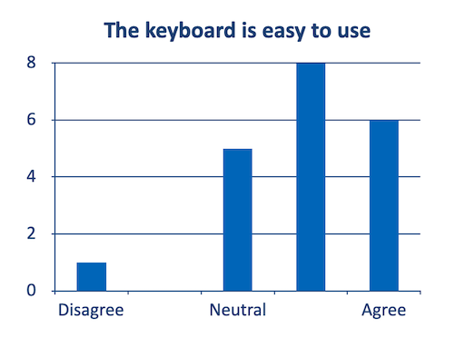
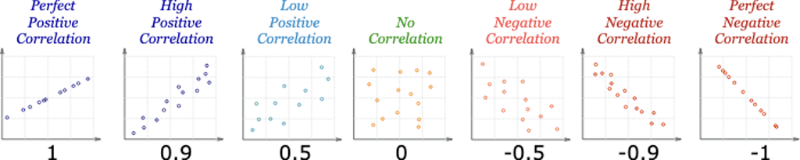
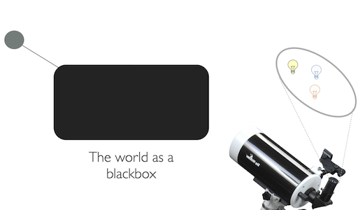
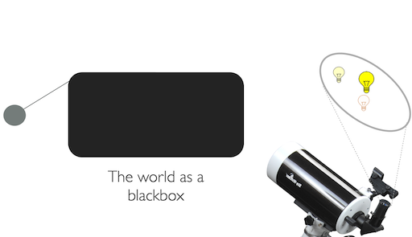
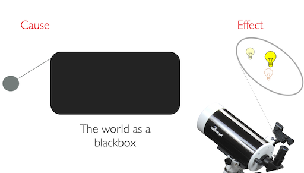
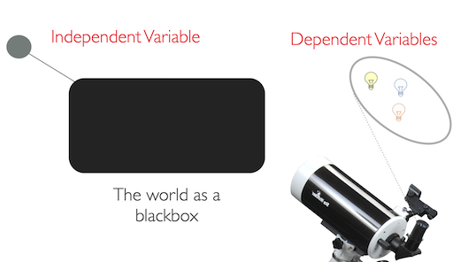
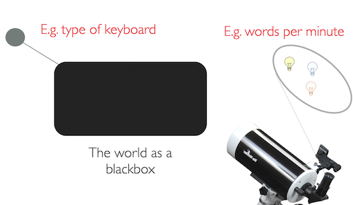
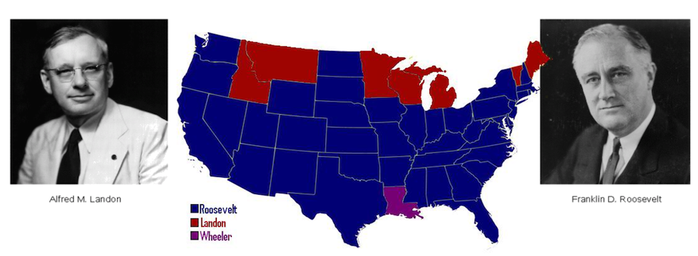
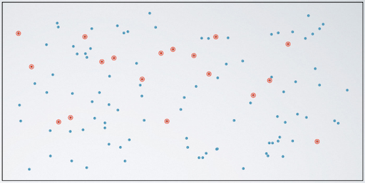

name: inverse
layout: true
class: center, middle, inverse
---

# Academic Methodologies

#### - Session 7 -

  

### Prof. Dr. Lena Gieseke | l.gieseke@filmuniversitaet.de  

#### Film University Babelsberg KONRAD WOLF

---
layout:false
## Today

--
* Next Step Paper Development

--

* Re-cap Experiments

--

* Statistics in a Nutshell

---
layout:false

## Paper Development - Methodology

--

It is time to think about how you want to answer the question(s) you are posing and structure your paper.  

--
 

Write down your methodology as overall paper structure (sections) and bullet points for each section. 

???
Who wants to go through this spontaneously?

*Submission*: Your paper structure and bullet points for each section. 

Brainstorm which steps you want to apply to get answers to your research question. This task does not aim to find your personal journey of investigation. You should work on defining the approach that you will present in a paper as your methodology (but of course, you can also reflect on what you, personally, need to do to get there). This task does not need to represent formal academic methods for now. It is more about a description of the steps in your own words, structured by the sections of a paper.

---
template:inverse

# Re-cap Experiments

---
layout:false

## Quantitative Research

Systematic investigation of observable phenomena via *statistical*, *mathematical*, or *computational techniques*.  

 
**The process of measurement is central.**

 
1. How to collect data?
2. How to analyse data?

---
## Experimental Research

With experiments researchers aim to measure ***cause* and *effect***.

---
## Experimental Research

*Is this keyboard easy to use?*

???

*Does this proof that the keyboard is easy to use?*

Agreement because
* They want to support us in our research?
* They were impressed by the system’s novelty?
* They liked the colors of the system?
* They were in a really good mood because the German football team won the world cup yesterday and everything in the world is great?

> Mere observation will not help us to find an valid answer!

  
* We have only established that there is a relationship between the numbers, but we know nothing about a *causation*. 
* How do we call this relationship?

## Correlation

.center[  [[mathsisfun]](https://www.mathsisfun.com/data/correlation.html)]

???
  

* A positive correlation indicates the extent to which those variables increase or decrease in parallel
* A negative correlation indicates the extent to which one variable increases as the other decreases
* [(Pearson’s) Correlation Coefficient](https://en.wikipedia.org/wiki/Pearson_correlation_coefficient) is a statistical measure of the *degree* to which changes to the value of one variable predict change to the value of another. This value is often called *r* and indicates *direction* and *strength* of a relationship between two variables. The closer it is to +1 or -1, the stronger there is a linear relationship between variables. 0 means there is no correlation, meaning no relationship.

---
## Experimental Research

Observation can tell us how things are **related**, not cause and effect.

--

 
In statistics *correlation* is any relationship between two random variables. 

???
  

* In statistics *correlation* (dependence or association) is any statistical relationship, whether causal or not, between two random variables. 

  
A correlation only proofs a relationship between the values of variables - which might be caused by any other factor or number of factors.

--
  
 
*So, what could we do to learn about cause and effect?*

---
## Experimental Research

> The only legitimate way to try to establish a causal connection statistically is through the use of randomized experiments.  
  
Utts, Jessica (2005) Seeing Through Statistics, Brooks/Cole (Thompson), p. 211.

???
  

* *How could such an experiment look like?*
* For example, for the study about video game and typing we, could assign the teenagers randomly to two groups. One group will spend a certain amount of time playing the computer game every week and the other group will not. After a period of time (e.g., 3 months or longer), we measure each teenager's typing speed. If the teenagers who play the computer game type significantly (and here we have to prove significance - we will come back to this) faster than the teenagers who do not play the game, we can draw conclusions that playing this computer game improves the typing skills of teenagers.

---
## Experimental Research

A well-designed, carefully analyzed experiment (or, better yet, series of experiments) isolates cause and effect. 

--
  

---
## Experimental Research

A well-designed, carefully analyzed experiment (or, better yet, series of experiments) isolates cause and effect. 

---
## Experimental Research

A well-designed, carefully analyzed experiment (or, better yet, series of experiments) isolates cause and effect. 
  

???
  

* However, already keep in mind that the result of an experiment establishes a *likelihood of causality*. Interpretations are based on statistics and do not give evidence to a deterministic causation. They do not prove that *If this is done, then this will be the result in all cases.*  Instead, what they say is, *If this is done, under these circumstances, then on average this will be the result.*.

---
.header[Experimental Research]

## Variables

Experiments are based on *dependent* on *independent* variables.

---
.header[Experimental Research]

## Variables

Experiments are based on *dependent* on *independent* variables.

???

* Independent variables refer to the factors that the researchers are interested in studying or the possible *cause* of the change. Hence, the independent variables describe the aspects that we change during an experiment, e.g. the hours the teenagers play the game in the previously mentioned example about playing a video game and typing capabilities. 
    **The term *independent* is used to suggest that the variable is independent of a participant's particular behavior or result.**
* Dependent variables refer to the outcome or effect that the researchers are interested in. Hence, dependent variables describe the aspects that derive from the controlled change of the independent variable, e.g. speed of typing in the previously mentioned example.  
    **The term *dependent* is used to suggest that the variable is dependent on a participant's particular behavior.**
* Dependent variables are commonly referred to as *scores* and can be measured.

---
.header[Experimental Research]

## Hypothesis

An experiment normally starts with a research hypothesis. 

  
 

A hypothesis is a precise problem statement that can be directly tested through a structured investigation. 

???
  

* Compared with a theory, a hypothesis is a smaller, more focused statement that can be examined by a single experiment (Rosenthal and Rosnow, 2008, as cited in [1]).

In order to conduct a successful experiment, it is crucial to start with one or more good hypotheses (Durbin, 2004, as cited in [1]).

--
  
 
Then, the experiment can **accept or reject the hypothesis**. 

???
  

* There is no limit on the number of hypotheses that can be investigated in one experiment. However, it is generally recommended that researchers should not attempt to study too many hypotheses in a single experiment. Normally, the more hypotheses to be tested, the more factors that need to be controlled and the more variables that need to be measured. This results in very complicated experiments, subject to a higher risk of design flaws.

Formalized statistical technique aiming to give a likelihood of a hypotheses to be true - often for the whole population. 

---
.header[Experimental Research]

## Hypothesis Testing

Based on a ***null-hypothesis***.

 
Assumes that there is **no** effect of the change in the independent variable on the measured variable.  

 

We need to falsify the null-hypothesis!

1. Proof that there is a effect
2. Proof that the effect is not random

???

Then the experiment aims to *disprove* the null-hypothesis using statistical measures. These statistical tests also aim to prove that the perceived effect is not random.

## Hypothesis Testing

Null hypothesis H0

* Assumes that there is no difference between two values (e.g. the means of the different experiment groups)
* H0: 𝜇1 = 𝜇2

Alternative hypothesis HA (or also often called H1 )

* Assumes significant differences
* HA: 𝜇1 != 𝜇2 or 𝜇1 > 𝜇2 or 𝜇1 < 𝜇2

---
.header[Experimental Research]

## Hypothesis Testing

A helpful example is here the criminal trial analogy:

* The defendant is innocent until proven guilty
    * H0: Defendant is not guilty
    * HA: Defendant is guilty
* There is no effect until proven otherwise

--

> In statistics, we always assume the null hypothesis is true, meaning that there is no cause and effect - until proven otherwise. Data is the evidence.

???
  

* As another example, suppose the developers of a website are trying to figure out whether to use a pull-down menu or a pop-up menu in the home page of the website. For this research case, the null and alternative hypotheses can be stated in classical statistical terms as follows:
    * HA: There is no difference between the pull-down menu and the pop-up menu in the time spent locating pages.
    * HA: There is a difference between the pull-down menu and the pop-up menu in the time spent locating pages.
* This might feel foreign to you. We will come back to this in the chapter about statistics.

---
.header[Experimental Research]

## Experiment Design

???
  

* The basic structure of an experiment can be determined by answering two questions:

--

* How many independent variables?
* How many different values does each independent variable have?

???
  

The answer to the first question determines whether we need a *basic* design or a *factorial* design. If there is one independent variable, we need only a basic one-level design. If there are two or more independent variables, factorial design is the way to go. The answer to the second question determines the number of conditions needed in the experiment. 

--

| Between-Group Design                                                | Within-Group Design                             |
| ------------------------------------------------------------------- | ----------------------------------------------- |
| + Clearer                                                           | + Smaller sample size                           |
| + Better control of confounding such as fatigue and learning effect | + Effective isolation of individual differences |
| - Large sample size                                                 | - Hard to control learning effects              |
| - Large impact of individual differences                            | - Large impact of fatigue                       |
| - Harder to get statistically significant results                   |                                                 |

???
  

Generally speaking, between-group design should be adopted when the experiment investigates

* simple tasks with limited individual differences
* tasks that would be greatly influenced by the learning effect or
* problems that cannot be investigated through a within-group design.
  
After choosing a between-group design for an experiment, we need to take special caution to control potential confounding factors. Participants should be randomly assigned to different conditions whenever possible. When assigning participants, we need to try our best to counterbalance potential confounding factors, such as gender, age, computing experience, and internet experience, across conditions. In other words, we need to make sure that the groups are as similar as possible, except for the personal characteristics that are experimental variables under investigation.

Within-group design is more appropriate when the experiment investigates

* tasks with large individual differences,
* tasks that are less susceptible to the learning effect, or
* when the target participant pool is very small.
  
Having decided to adopt a within-group design, you need to consider how to control the negative impact of learning effects, fatigue, and other potential problems associated with a within-group design.  

An effective approach to reduce the impact of the learning effect is for example to provide sufficient time for training, which reduces the learning effect during the actual task sessions. To address the problem of fatigue caused by multiple experimental tasks, we need to design experiment tasks frugally, reducing the required number of tasks and shortening the experiment time whenever possible. It is generally suggested that the appropriate length of a single experiment session should be 60 to 90 minutes or shorter (Nielsen, 2005, as cited in [1]).
  
[1]

---
.header[Experimental Research | Hypothesis Testing]

## Control Conditions

--

Experiments are often based on *control conditions*.

Compare two scenarios:

1. The cause is present (the *experimental condition*)
2. The cause is absent (the *control condition*)

Null-hypothesis: There is no difference between Scenario 1 and 2.

???
  
The idea is to compare two situations where in one the supposed cause is present (the *experimental condition*) to one where it is absent (the *control condition*).
   
The control condition isolates the suspected effect on the dependent variable. 

* For example, let's talk about storks and babies again. Let's say we are still considering that storks do, in fact, cause babies.

*How could the experimental and controls conditions look like to test our hypothesis?*

* The experimental condition is a group of couples residing on a stork farm.
* The control condition are a group of couples residing on a chicken farm.
    * Extra-long artificial beaks would have to be fitted to the chickens and they would need to wear red stilts to make the subjects *blind* to their respective group.

Hypothesis testing

* H0: There is no effect of living on a stork farm on the birthrate.
* HA: There is an effect of living on a stork farm on the birthrate.

---
.header[Experimental Research]

## Sampling

--

*Which specific entities to test?*

???
  

* In a true experimental design, the researcher can fully control or manipulate the experimental conditions so that a direct comparison can be made between two or more conditions while other factors are, ideally, kept the same. One aspect of the full control of factors is complete *randomization*, which means that the researcher can randomly assign participants to different conditions. The capability to effectively control for variables not of interest, therefore limiting the effects to the variables being studied, is the feature that most differentiates experimental research.

--

Sampling decides how to select individuals from a population.

--
  
 

> Correct sampling is crucial to any type of study and an incorrect sample frame can destroy a study, regardless of the sample size.

???
  

* A famous example is the president election in the US in 1936. The candidates were the Republican Landon vs. the Democrat Roosevelt. Before the election there was a telephone survey by „Literary Digest“ with as many as 10,000,000 phone calls and
2,300,000 participants (45,600,000 voters). The prediction was clear, there would be a landslide victory for Landon.

However, the election results turned out to be as follows (red republican, blue democratic wins)

---
.header[Experimental Research]

## Sampling

.center[]

???
  

* A famous example is the president election in the US in 1936. The candidates were the Republican Landon vs. the Democrat Roosevelt. Before the election there was a telephone survey by „Literary Digest“ with as many as 10,000,000 phone calls and
2,300,000 participants (45,600,000 voters). The prediction was clear, there would be a landslide victory for Landon.

However, the election results turned out to be as follows (red republican, blue democratic wins)

--

*Why did the survey go so wrong?*

???
  

* Think about the year 1936 and who would own a telephone at that time...

---
.header[Experimental Research | Sampling]

## Randomization

Randomize all factors that you can not fully control and might influence the effect.

* Participant
* Order of tasks

???
  
> A simple random sample (SRS) of size n consists of n individuals from the population chosen in such a way that every set of n individuals has an equal chance to be the sample actually selected.  
  
Moore, David S. and George P. McCabe (2006), Introduction to the Practice of Statistics, fifth edition, Freeman, p. 219

In a well-designed experiment, you try to randomize all factors possible, such as the assignment of participants and the order of tasks. 

* For example, you assign participants randomly into groups in order to spread factors such as intelligence, motivtation, tiredness, physical capabilities and such. Similarly, you want to run conditions and tasks in random order to avoid sequence effects, such as learning or training influences or tiredness for the last tasks.
* Nowadays, software-driven randomization is commonly used for tasks like this. A large number of randomization software resources are available online, such as https://www.randomizer.org/. Randomization functions are also available in most of the commercial statistical software packages.  

  
[[researchhubs]](researchhubs.com/post/ai/data-analysis-and-statistical-inference/observational-studies-and-experiments-sampling-and-source-bias.html)

---
.header[Experimental Research]

## Reliability
  
Reflect on
* Random Errors
* Systematic Errors

???
  

* Random errors are also called *noise*. They occur by chance and are not correlated with the actual value. There is no way to eliminate or control random errors but we can reduce the impact of random errors by enlarging the observed sample size. When a sample size is small, the random errors may have significant impact on the observed mean and the observed mean may be far from the actual value. When a sample size is large enough, the random errors should offset each other and the observed mean should be very close to the actual value.

* To disproportionately weight in favor of or against an idea or thing is called [bias](https://en.wikipedia.org/wiki/Bias).  

Systematic errors are also called *biases* and they are completely different in nature from random errors. While random errors cause variations in observed values in both directions around the actual value, systematic errors always push the observed values in the same direction. As a result, systematic errors never offset each other in the way that random errors do and they cause the observed mean to be either too high or too low.

Systematic errors can greatly reduce the reliability of experimental results. They are the true enemy of experimental research. We can counter systematic errors in two stages: we should try to eliminate or *control biases* during the experiment when biases are inevitable, and we need to *isolate the impact* of them from the main effect when analyzing the data. 

There are five major sources of systematic errors:

    * Measurement instruments
    * Experimental procedures
    * Participants
    * Experimenter behavior
    * Experimental environment

 

* Bias Caused by Measurement Instruments
    * When the measurement instruments used are not appropriate, not accurate, or not configured correctly, they may introduce systematic errors. For example when the stop button of a timer is broken and it takes a moment to stop the time, we have a systematic addition of time to the actual task. If now another research team would reproduce the experiment, they would get different timings with a properly working stop watch.
* Bias Caused by Experimental Procedures
    * Inappropriate or unclear experimental procedures may introduce biases. As discussed previously, if the order of task conditions is not randomized in an experiment with a within-group design, the observed results will be subject to the impact of the learning effect and fatigue.  
    * Also, the instructions that participants receive play a crucial role in an experiment and the wording of the experiment instructions should be carefully scrutinized before a study. Slightly different wording in instructions may lead to different participant responses. In a reported HCI study (Wallace et al., 1993, as cited in [1]), participants were instructed to complete the task “as quickly as possible” under one condition. Under the other condition, participants were instructed to “take your time, there is no rush.” Interestingly, participants working under the no-time-stress condition completed the tasks faster than those under the time-stress condition. This suggests the importance and complexity of finding a suitable wording in instructions. It also implies that the instructions that participants receive must be highly consistent.
    * One approach to avoid biases attributed to experimental procedures, are *pilot studies*. A pilot study is a test run of the experiment and are critical for experiments to identify potential biases. No matter how well you think you have planned the study, there are always things that you overlook. A pilot study is the only chance you have to fix your mistakes before you run the main study.
* Bias Caused by Participants (Sampling)
    * Bias in sampling is sometimes called *ascertainment bias* (especially in biological fields). E.g. the above mentioned telephone survey about the presidential election in 1936 systematically favored rich peoples' opinions as at that time only rich people could be reached by telephone.
    * Bias in the selection of participants is often due to *convenience*, e.g. selecting members of the same department, students from the university, etc. For example, an analysis of leading psychology journals in the US found out that a random American undergraduate is about 4,000 times more likely than an average human being to be the subject of national academic study.
    * Make sure to recruit carefully and make sure that the participant pool is representative of the target population.
* Bias Due to Experimenter Behavior
    * Experimenter behavior is one of the major sources of bias. Experimenters may intentionally or unintentionally influence the experiment results. Any intentional action to influence participants' performance or preference is unethical in research and should be strictly avoided. However, experimenters may unknowingly influence the observed data. Spoken language, body language, and facial expressions frequently serve as triggers for bias. Just imagine an experimenter is introducing an interface to a participant. Then experimenter says, “Now you get to the pull-down menus. I think you will really like them.… I designed them myself!”. Or consider how it might influence a performance, if the experimenter arrives late and the participant had been waiting for 45 minutes...
* Bias Due to Environmental Factors
    * Environmental factors can be categorized into two groups: physical environmental factors and social environmental factors. Examples of physical environmental factors include noise, temperature, lighting, vibration, and humidity. Examples of social environmental factors include the number of people in the surrounding environment and the relationship between those people and the participant.

---

## In Summary

Experiments help us to answer questions and identify *causal* relationships.  

 
> Successful experimental research depends on well-defined research *hypotheses* that specify the *dependent variables to be observed and measured* and the *independent variables to be controlled*. 

 
*Significance testing* allows us to judge whether the results might be random.

???
  

* Usually a pair of null and alternative hypotheses is proposed and the goal of the experiment is to test whether the null hypothesis can be rejected or the alternative hypothesis can be accepted. Good research hypotheses should have a reasonable scope that can be tested within an experiment; clearly defined independent variables that can be strictly controlled; and clearly defined dependent variables that can be accurately measured.  

* All significance tests are subject to two types of error. *Type I errors* refer to the situation in which the null hypothesis is mistakenly rejected when it is actually true. *Type II errors* refer to the situation of not rejecting the null hypothesis when it is actually false. It is generally believed that Type I errors are worse than Type II errors, meaning it is worse to accept an causal relationship when there is none.

Hence, the *design of an experiment* starts with a clearly defined, testable research hypothesis. During the design process, we need to answer the following questions:

* How many dependent variables are investigated in the experiment and how are they measured?
* How many independent variables are investigated in the experiment and how are they controlled?
* How many conditions are involved in the experiment?
* Which grouping to use, a between-grouping or within-grouping?
* What potential bias may occur and how can we avoid or control those biases?
  
All experiments strive for clean, accurate, and unbiased results. In reality, experiment results are highly susceptible to bias. Biases can be attributed to five major sources: the measurement instruments, the experiment procedure, the participants, the experimenters, and the physical and social environment. We should try to avoid or control biases through accurate and appropriate measurement devices and scales; clearly defined and detailed experimental procedures; carefully recruited participants; well-trained, professional, and unbiased experimenters; and well-controlled environments.

With its notable strengths, experimental research also has notable limitations when applied in fields such as HCI or CTech: difficulty in identifying a testable hypothesis, difficulty in controlling potential confounding factors, and changes in observed behavior as compared to behavior in a more realistic setting. Therefore, experimental research methods should only be adopted when appropriate.

## Limitations of Experimental Research

To date, experimental research remains one of the most effective approaches to making findings that can be generalized to larger populations. On the other hand, experimental research also has notable limitations.  

It requires well-defined, testable hypotheses that consist of a limited number of dependent and independent variables. However, many problem, for example in in HCI research, are not clearly defined or involve a large number of potentially influential factors. As a result, it is often very hard to construct a well-defined and testable hypothesis. This is especially true when studying an innovative interaction technique or a new user population and in the early development stage of a product.  

Experimental research also requires strict control of factors that may influence the dependent variables. That is, except the independent variables, any factor that may have an impact on the dependent variables, often called potential confounding variables, needs to be kept the same under different experiment conditions. This requirement can hardly be satisfied in many HCI / CTech studies. For example, when studying how older users and young users interact with computer-related devices, there are many factors besides age that are different between the two age groups, such as educational and knowledge background, computer experience, frequency of use, living conditions, and so on. If an experiment is conducted to study the two age groups, all those factors will all a significant impact on the observed results. This problem can be partially addressed in the data collection and data analysis stages. In the data collection stage, extra caution should be taken when there are known various influencing factors. Increasing the sample size may reduce the impact of the side factors. When recruiting participants, prescreening should be conducted to make the participants in different groups as homogeneous as possible.  

Lab-based experiments may not be a good representation of users' typical interaction behavior. It has been reported that participants may behave differently in lab-based experiments due to the stress of being observed, the different environment, or the rewards offered for participation. This phenomenon, called the *Hawthorne effect*, was documented around 60 years ago (Landsberger, 1958, as cited in [1]). The *Hawthorne effect* has by now be challenged and its effects were further refined. But still, we should keep this potential risk in mind and take precautions to avoid or alleviate the impact of the possible Hawthorne effect.

---
## Quantitative Research

Systematic investigation of observable phenomena via *statistical*, *mathematical*, or *computational techniques*.  

 
The process of measurement is central.

 
1. How to collect data?
2. How to analyse data?

???

Potential goal: To make conclusion from the collected data about the whole population.

---
## Quantitative Research

Systematic investigation of observable phenomena via *statistical*, *mathematical*, or *computational techniques*.  

 
**The process of measurement is central.**

 
1. How to collect data?
2. **How to analyse data?** → [Statistics](./am_08_statistics_slides.html)

???
[am_08_statistics_slides](./am_08_statistics_slides.html)

Potential goal: To make conclusion from the collected data about the whole population.

---
template:inverse

### The End

# 👋🏻
