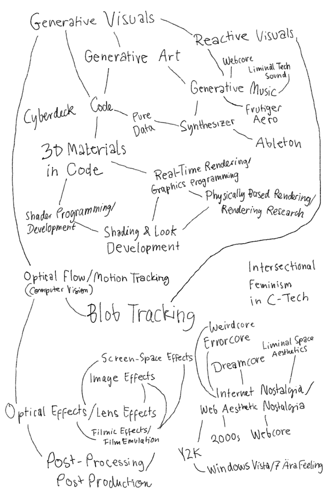

Academic Methodologies

Bonita Fiona von Gizycki | bonita.gizycki@filmuniversitaet.de | Film University Babelsberg KONRAD WOLF

# **Task 01.01 - Working With Literature**

*Submission*: 

I will organize my papers and summary notes in Notion, because it helps me keep everything clear and structured. For deeper notes and connections between ideas, I use Obsidian.

For reading and highlighting, I use Kindle, where I can mark important parts and add short notes. I may also use NotebookLM to understand difficult sentences.

My workflow is simple: I read and highlight first, then I write deeper notes in Obsidian, and organize everything in Notion. I'll use Zotero as well. 

I prefer working fully digital and do not see a need to print PDFs.

# Task 01.02 - Topic Brainstorming

*Submission:* Bullet points of all your topic ideas.

### Code als ästhetisches Medium
- Generative Visuals
- Generative Art
- Reactive Visuals
- Generative Music
- Code
- Pure Data
- Synthesizer
- Ableton
- 3D Materials in Code
- Real-Time Rendering / Graphics Programming
- Physically Based Rendering / Rendering Research
- Shader Programming / Development
- Shading & Look Development
### Visuelle Effekte & Post-Production
- Optical Flow / Motion Tracking (Computer Vision)
- Blob Tracking
- Screen-Space Effects
- Image Effects
- Optical Effects / Lens Effects
- Filmic Effects / Film Emulation
- Post-Processing / Post Production
### Internetkulturelle Ästhetik & digitale Nostalgie
- Webcore
- Liminal Tech Sound
- Frutiger Aero
- Weirdcore
- Errorcore
- Dreamcore
- Liminal Space Aesthetics
- Internet Nostalgia / Web Aesthetic Nostalgia
- 2000s Webcore
- Y2K
- Windows Vista / 7 Ära Feeling
### Gesellschaft & Technologie
- Intersectional Feminism in C-Tech
- Cyberdecks

# Task 01.03 - Topic Selection

*Submission:* Your selection of three topics and a brief motivation for each selection.

## Paper Topic Selection

### Topic 1 → Code as a Medium for Emotional and Sensory Experience

#### What interests me about this topic:
Code-based tools as for example Pure Data, Three.js, or TouchDesigner offer a different creative freedom than software wich has a more usefriendly interface. What fascinates me most is how generative systems, through their interactive components, have the capacity to influence feelings, both visually and sonically. As a designer who is just beginning to produce music, I'm drawn to the connection between technical systems and the emotional experiences they create.

In short: I want to investigate code as an expressive, emotionally resonant medium.
I want to research how code-based tools can create emotional and sensory experiences through generative and interactive systems.

#### Characteristics of this topic:

- Sits at the intersection of creative coding, interaction design, and affect theory (Affect theory examines how rapid, physical emotions influence our behavior, often before we consciously think about it)
- Covers both visual and sonic dimensions of generative/interactive work
- Raises questions about authorship, accessibility, and the role of AI in code-based creativity
- Relevant to tools like Pure Data, TouchDesigner, Three.js, and live-coding environments

#### Possible research questions:

- How can interactive, code-based systems deliberately evoke or amplify emotional states?
- What distinguishes the emotional experience of generative/interactive art from static media?
- What role does user participation play in creating emotional connection within generative systems?

---

### Topic 2 → Internet Aesthetics as Digital Escapism

#### What interests me about this topic:
Y2K, Dreamcore, Liminal Space, and Weirdcore function not just as nostalgia, maybe they are spaces of escapism. For a generation that grew up with these images, they trigger feelings of comfort, fantasy, and being understood. I'm interested in how these aesthetics work as spaces for escape and emotional processing, and why they reproduce so strongly in contemporary design practice, including my own.

#### Characteristics of this topic:

- Rooted in the internet subcultures and visual forms of expression of the early 2000s web
- Connects design history, collective memory, and Gen Z identity
- Has a strong presence in current creative and design trends/communities
- Blurs the line between nostalgia, fantasy, and genuine cultural commentary

#### Possible research questions:

- What escapist functions do Liminal and Dreamcore aesthetics serve for Gen Z?
- How does digital nostalgia differ from classical nostalgia, is it more about escape or processing?
- How do these aesthetics flow into design and creative technology as a creative strategy?

---

### Topic 3 → Hyperfemininity, Cyberdecks & Access to Tech Culture

#### What interests me about this topic:
A TikTok by creator Ube Boobey, who built a cyberdeck into a stylish vintage bag, went viral, not because she invented something new, but because her hyperfeminine aesthetic offered a completely different entry point into tech culture. It immediately motivated me to build one myself, even though I hadn't felt any connection to the topic before. I'm interested in how representation and aesthetics determine who feels like they belong in tech spaces.

#### Characteristics of this topic:

- Connects feminist theory, DIY/maker culture, and tech accessibility
- Touches on questions of representation, identity, and community gatekeeping
- Cyberdecks as objects sit at the intersection of self-expression, utility, and subculture
- Directly relevant to intersectional feminism within creative technologies

#### Possible research questions:

- What role does aesthetic representation play in determining who feels addressed by tech culture?
- How does hyperfeminine tech content shift the perception of who belongs in tech spaces?
- What is the relationship between cyberdecks as DIY objects and notions of self-empowerment and identity?
