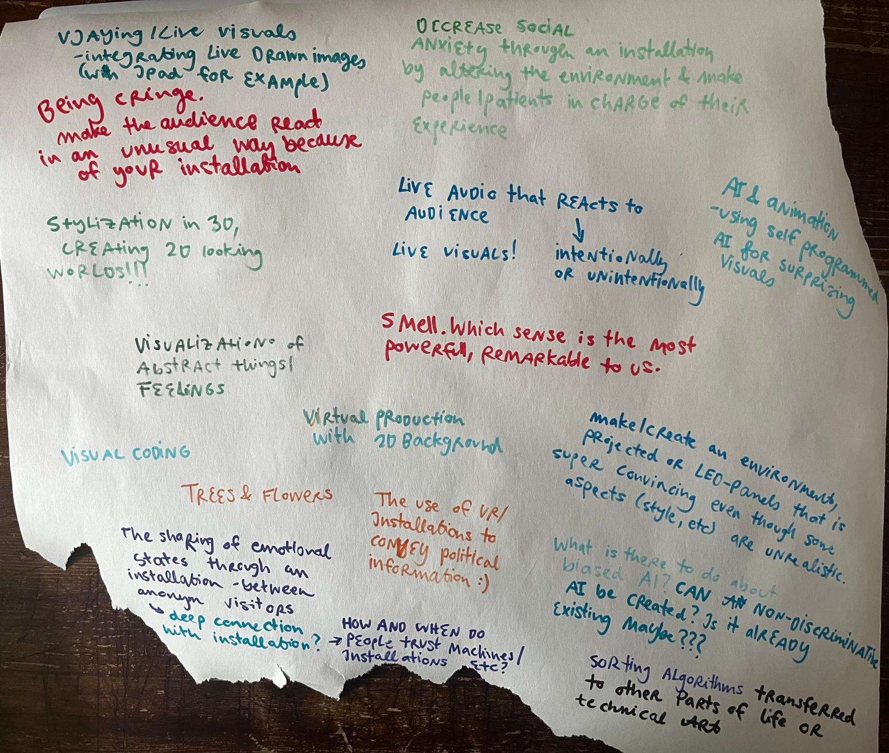
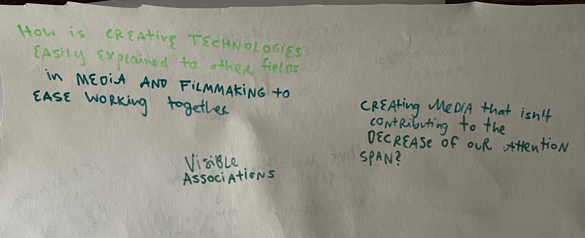

## Task 01.02 - Topic Brainstorming

## Task 01.03 - Topic Selection

#### Three research topics that interest me:

### 1. IMPACT OF INSTALLATIONS ON VISITORS
The effect of Installations can be very different on visitors based on spatial design, sensor technology or interface design. What interests me is how an installation can shape people from visitors to participants and can actually change the behaviour of visitors in a way that they feel encouraged to act differently than they normally would. 
How can someone get so immersed that they forget social norms of inscecurities?
How can a safe space be created so that visitors feel welcome enough to engage?
What does it take technically? 
How much does visible feedback matter to shape the interaction - does clearly seeing the impact of their actions influence visitors to try out more? 
An interesting direction could be how an installation can actually change the psychic state of someone (e.g have an impact on distress, anxiety, nervousity)

### 2. DESIGN OF LIVE VISUAL SYSTEMS
What interests me about live visual performance is the question of how a hybrid pipeline could work in practice, combining for example hand drawn elements from a tablet with audioreactive Visuals. And going furhter: could AI be used in that chain for transforming drawn input into somethng new, which then gets included in the live visual output? How could this generation be surprising but still linked to my specific ideas? How would such a pipeline be structured, and how could it be optimised for a live performance context?
How can a system respond not just to measurable musical parameters like BPM or frequency, but to the overall feel of the music?
What is an easy way to live implement drawn elements into the visual output? How to find a balance between automated and manual?

### 3. USING MEDIA TO COUNTER MEDIA
The widespread consumption of digital media has been associated with a range of documented cognitive and social effects, e.g. declining attention spans, emotional numbness toward difficult of violent content or a reduced capacity for critical thinking. THese conditions make people more vulnerable to influence, which can be seen in the effective spread of right wing political content accross platforms like TikTok or Instagram. The general decline in critical engagement is closely linked to the spread of misinformation and the tendency to accept oversimplified narratives. The obvious first approach for people to reduce media consumption altogether is highly unrealistic. So the more interesting question for me is if any type of media can be shaped so that consumers benefit from the it.

How can political content be conveyed in a way that is more objective and encourages people to actually think rather than just react? How can heavy or important topics be communicated in a way that motivates someone to take action instead of scrolling past?
Where and how can people be reached outside of the algorithms of big platforms?
Are the already existing tools or apps working on this, do they show any measurable results?